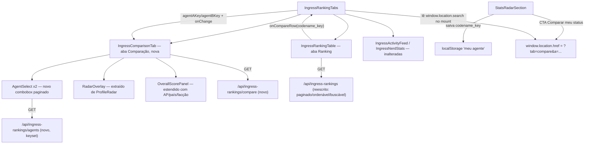

# Ingress Ranking Comparison Design

**Spec**: `.specs/features/ingress-ranking-comparison/spec.md`
**Status**: Approved

---

## Architecture Overview

Três mudanças server-side novas/estendidas sob `/api/ingress-rankings`, mais uma 4ª aba client-side em `IngressRankingTabs`:



`IngressRankingTable` (aba "Ranking") e `StatsRadarSection` (painel de envio, fora de `IngressRankingTabs`) continuam sendo Client Components irmãos sob o `page.tsx` Server Component — a mesma restrição que já forçou o poll independente da tabela (ver comentário `SPEC_DEVIATION` em `IngressRankingTable.tsx:320-330`) impede uma prop/callback direto entre eles. A "Comparar meu status" reaproveita o ÚNICO canal de comunicação entre ilhas client que já existe no projeto para esse cenário: a URL (mesmo mecanismo do `?destaque=` que `IngressRankingTable` já lê pós-hidratação). O atalho "Comparar" por linha (P2) não tem esse problema — `IngressRankingTable` já é filho direto de `IngressRankingTabs`, então é uma prop/callback comum.

---

## Code Reuse Analysis

### Existing Components to Leverage

| Component | Location | How to Use |
| --- | --- | --- |
| `ProfileRadar`'s SVG/tabela de comparação | `components/ingress/ProfileRadar.tsx:347-522` | Extraído para `RadarOverlay.tsx` (novo) — usado tanto pelo `ProfileRadar` (variant `default`, modos `vs-me`/`two`) quanto pela nova aba Comparação, sem duplicar a matemática do polígono |
| `OverallScorePanel` | `components/ingress/stats/OverallScorePanel.tsx` | Já renderiza nota geral + selo de tier + nota por eixo para N agentes lado a lado — estendido (campos opcionais) para também mostrar AP/país/facção quando presentes |
| `CountryPicker` | `components/ingress/CountryPicker.tsx` | Modelo estrutural (ARIA combobox+listbox, `value`/`onChange` controlado, `foldText`) para o novo `AgentSelect` — mesmo padrão, adaptado para dados assíncronos/paginados em vez de uma lista estática |
| Padrão `?destaque=` lido via `window.location.search` em `useEffect` | `IngressRankingTable.tsx:355-362` | Mesmo idiom para ler `?tab=&a=&b=` no mount de `IngressRankingTabs` (evita exigir `<Suspense>` por causa de `useSearchParams()`, mesma razão já documentada no código-fonte) |
| `computeRadarAxes`/`compareRadar`/`RADAR_AXES` | `lib/ingress-radar.mjs` | Reaproveitado sem mudança pelo `RadarOverlay` |
| `foldText`, `fmtStat` | `lib/ingress-format.mjs` | Reaproveitado pelo `AgentSelect` (busca client-side dentro da página já carregada) e pelos painéis de comparação |
| `flagSrc`, `COUNTRIES` | `lib/ingress-countries.mjs` | Reaproveitado pelo `AgentSelect` para o emblema de país |
| `normalizeCodenameKey` | `lib/ingress-rankings.mjs` | Reaproveitado para resolver `codename_key` a partir do codinome salvo/submetido |

### Integration Points

| System | Integration Method |
| --- | --- |
| `casara.ingress_rankings` (Neon) | Duas rotas GET novas (`/agents`, `/compare`) e uma reescrita (`GET /api/ingress-rankings`) — todas leitura pública, sem token, sem rate-limit (decisão já confirmada na spec, mesmo padrão dos GETs existentes) |
| `sql.query(text, params)` do driver `@neondatabase/serverless` | Necessário (em vez do tagged template `sql\`...\``) porque a coluna de ORDER BY é dinâmica — nomes de coluna não são parametrizáveis num tagged template. A coluna nunca vem direto do input: passa por uma allow-list (`isValidSortKey`) antes de virar uma string SQL fixa vinda de uma constante (`SORT_COLUMN_EXPR`), nunca interpolação do valor do visitante |
| `localStorage` | Nova chave dedicada (`lib/ingress-my-agent.ts`), independente da chave de dedupe do Telegram (`ing-cmp-sent`) já existente em `ProfileRadar.tsx` |

---

## Components

### `lib/ingress-rankings.mjs` (estendido)

- **Purpose**: regras puras de paginação/ordenação/busca do ranking — allow-lists e construtores de query SQL parametrizada, sem tocar em `fs`/DB (client-safe, já importado por `StatsRadarSection.tsx`, um Client Component)
- **Location**: `lib/ingress-rankings.mjs`
- **Interfaces**:
  - `isValidPageSize(n): boolean` — allow-list `[20, 50, 100]`
  - `isValidSortKey(key): boolean` — allow-list `['score','ap','country','construcao','destruicao','exploracao','hacking','linksCampos']`
  - `defaultSortDir(key): 'asc'|'desc'`
  - `buildRankingPageQuery({page, pageSize, sortKey, sortDir, search, faction}): {text: string, values: unknown[]}` — monta a query da tabela principal (rank canônico via `ROW_NUMBER() OVER`, busca/filtro/ordenação/paginação)
  - `buildAgentOptionsQuery({cursor, search}): {text: string, values: unknown[]}` — monta a query do seletor (keyset por `codename_key`, ou busca sem cursor)
- **Dependencies**: nenhuma (funções puras)
- **Reuses**: nada externo — só o já existente `normalizeCodenameKey`/`compareRankingRows` continuam como estão

### `app/api/ingress-rankings/route.ts` (GET reescrito)

- **Purpose**: tabela principal paginada/buscável/ordenável no servidor
- **Location**: `app/api/ingress-rankings/route.ts`
- **Interfaces**: `GET ?page&pageSize&sort&dir&search&faction` → `{rows: (RankingRow & {rank:number})[], total: number, page: number, pageSize: number}`
- **Dependencies**: `lib/ingress-rankings.mjs` (query builder + allow-lists), `lib/ingress-tier-score.mjs` (`computeStatTiers`, como já fazia)
- **Reuses**: `sql.query()` do `lib/db.ts` (Proxy já repassa `.query`, confirmado em `@neondatabase/serverless/index.d.ts`)

### `app/api/ingress-rankings/agents/route.ts` (novo)

- **Purpose**: alimentar o `AgentSelect` — lista paginada (keyset, 100/página) ou busca por substring
- **Location**: `app/api/ingress-rankings/agents/route.ts`
- **Interfaces**: `GET ?cursor&search` → `{rows: {codename_key, codename, faction, country_code, lifetime_ap}[], hasMore: boolean, nextCursor: string|null}`
- **Dependencies**: `lib/ingress-rankings.mjs` (`buildAgentOptionsQuery`)

### `app/api/ingress-rankings/compare/route.ts` (novo)

- **Purpose**: resolver 1 ou 2 `codename_key` para os dados completos necessários à comparação (e também para o `AgentSelect` mostrar o nome de um agente pré-selecionado que não está na página carregada)
- **Location**: `app/api/ingress-rankings/compare/route.ts`
- **Interfaces**: `GET ?a&b` (ambos opcionais independentemente) → `{a: CompareRow|null, b: CompareRow|null}`, `CompareRow = {codename_key, codename, faction, lifetime_ap, overall_score, axis_scores, stat_values, country_code}`
- **Error handling**: `a === b` (mesmo `codename_key`, normalizado) → 400 (o cliente não deveria nem chamar essa combinação, mas a rota não confia nisso)

### `components/ingress/RadarOverlay.tsx` (novo, extraído de `ProfileRadar`)

- **Purpose**: desenhar o radar SVG (1 ou 2 polígonos) + tabela de comparação por eixo/parte + painel de breakdown por hover/tap — puramente apresentacional a partir de `Agent`s já prontos
- **Location**: `components/ingress/RadarOverlay.tsx`
- **Interfaces**: `({agentA: Agent, agentB?: Agent, blank?: boolean, labelA?: string, labelB?: string}) => JSX`
- **Dependencies**: `computeRadarAxes`, `compareRadar`, `RADAR_DRAW_MAX` de `lib/ingress-radar.mjs`; `fmtStat`
- **Reuses**: é a extração de `ProfileRadar.tsx:347-522` (SVG + `ing-radar__cmp-table` + breakdown) — sem mudança de marcação/CSS, só de local. `ProfileRadar` passa a montar `formBlock` (o colar-texto) e delegar o desenho a este componente; a nova aba Comparação usa só este componente, sem `formBlock`

### `components/ingress/AgentSelect.tsx` (novo)

- **Purpose**: combobox para escolher 1 agente já cadastrado — páginas de 100 por `codename_key` (ordem alfabética case-insensitive, pois `codename_key = normalizeCodenameKey(codename)`) com "próxima página" incremental, ou busca por substring que substitui a navegação por página
- **Location**: `components/ingress/AgentSelect.tsx`
- **Interfaces**:
  ```ts
  {
    id: string
    value: string | null                 // codename_key selecionado
    onChange: (codenameKey: string | null) => void
    selected: AgentOption | null          // dado resolvido pelo pai (via /compare) p/ exibir no campo fechado mesmo se a opção não estiver nas páginas carregadas
    invalid?: boolean                     // ex.: "mesmo agente nos dois campos"
  }
  ```
- **Dependencies**: `GET /api/ingress-rankings/agents`; `flagSrc`/`COUNTRIES` (`lib/ingress-countries.mjs`); `foldText` (debounce de busca)
- **Reuses**: estrutura ARIA combobox+listbox de `CountryPicker.tsx` (adaptada para fetch assíncrono, "carregar mais" e estados de loading/erro/vazio)

### `components/ingress/stats/IngressComparisonTab.tsx` (novo)

- **Purpose**: orquestrar os dois `AgentSelect`, resolver os dados via `/compare`, decidir entre estado de espera / bloqueio (mesmo agente) / erro / comparação renderizada, disparar `trackIngressComparisonViewed`
- **Location**: `components/ingress/stats/IngressComparisonTab.tsx`
- **Interfaces**:
  ```ts
  {
    agentAKey: string | null
    agentBKey: string | null
    onChangeA: (key: string | null) => void
    onChangeB: (key: string | null) => void
    aFromUrl: boolean   // só o valor inicial vindo de link compartilhado mostra aviso "agente não encontrado"; localStorage/vazio falham em silêncio
    bFromUrl: boolean
  }
  ```
- **Dependencies**: `GET /api/ingress-rankings/compare`; `RadarOverlay`; `OverallScorePanel` (estendido); `AgentSelect` ×2; `trackIngressComparisonViewed`
- **Reuses**: `RadarOverlay`, `OverallScorePanel`, `AgentSelect`

### `components/ingress/stats/IngressRankingTabs.tsx` (reescrito)

- **Purpose**: dono do estado compartilhado entre as abas — aba ativa, `agentAKey`/`agentBKey`, resolução de precedência (URL > atalho de linha > localStorage > vazio) no mount
- **Location**: `components/ingress/stats/IngressRankingTabs.tsx`
- **Reuses**: mesmo idiom de `window.location.search` em `useEffect` já usado por `IngressRankingTable` para `?destaque=`

### `components/ingress/stats/IngressRankingTable.tsx` (reescrito)

- **Purpose**: tabela principal, agora server-paginada/buscável/ordenável; ganha o botão "Comparar" por linha (P2)
- **Mudança principal**: `search`/`factionFilter`/`sortKey`/`sortDir` deixam de filtrar `rows` localmente — viram parâmetros de uma nova busca ao servidor (com `page` resetando para 1 a cada mudança); `rank` vem pronto em cada linha da API (não mais `rankByKey` calculado do array completo em memória, que deixa de existir)
- **Reuses**: mantém expand/detail/share/highlight/poll como estão (poll agora refaz a página/filtro/ordenação atuais, não mais "top 100" fixo)

### `lib/ingress-my-agent.ts` (novo)

- **Purpose**: única fonte da chave de `localStorage` para "meu agente" + getters/setters — usado por `StatsRadarSection` (grava) e `IngressRankingTabs` (lê)
- **Interfaces**: `MY_AGENT_STORAGE_KEY: string`, `saveMyAgent(codenameKey: string): void`, `loadMyAgent(): string | null`

---

## Data Models

Nenhuma coluna nova — a feature é 100% leitura sobre `casara.ingress_rankings` (já documentada em `lib/schema.sql`). Os tipos abaixo são só o formato de resposta das rotas novas/reescritas:

```typescript
type RankingApiRow = {
  codename_key: string
  codename: string
  faction: 'enlightened' | 'resistance'
  lifetime_ap: number
  overall_score: number
  axis_scores: Record<string, number>
  stat_values: Record<string, number>
  stat_tiers: Record<string, {tier: string; badgeSlug: string | null}>
  country_code: string | null
  recursions: number | null
  created_at: string
  updated_at: string
  rank: number   // posição canônica global — nunca relativa ao filtro/ordenação aplicado
}

type AgentOption = {
  codename_key: string
  codename: string
  faction: 'enlightened' | 'resistance'
  country_code: string | null
  lifetime_ap: number
}

type CompareRow = {
  codename_key: string
  codename: string
  faction: 'enlightened' | 'resistance'
  lifetime_ap: number
  overall_score: number
  axis_scores: Record<string, number>
  stat_values: Record<string, number>
  country_code: string | null
}
```

**Relationships**: todos derivados 1:1 de linhas de `casara.ingress_rankings`, sem joins novos.

---

## Error Handling Strategy

| Error Scenario | Handling | User Impact |
| --- | --- | --- |
| `GET /api/ingress-rankings` (tabela) falha | `try/catch` no handler + no `IngressRankingTable` (fetch retorna `null`, estado de erro local) | Tabela mostra estado de erro inline com "tentar de novo", mantém a última página boa visível |
| `GET .../agents` falha | `AgentSelect` guarda estado `error` por instância | Listbox mostra erro + botão de retry, resto da página intacta (IRCMP-13) |
| `GET .../compare` falha | `IngressComparisonTab` guarda `error` | Erro inline na área da comparação, selects continuam preenchidos, permite tentar de novo (edge case da spec) |
| `codename_key` de `localStorage` não existe mais no ranking | `/compare` devolve `a: null` para essa chave | Campo A fica vazio, sem erro (IRCMP-27) |
| `codename_key` de query param (link compartilhado) não existe mais | `/compare` devolve `null` para essa chave | Aviso inline "agente não encontrado" nesse campo (IRCMP-35), resto da página funciona |
| Mesmo agente nos dois campos | Checado no cliente antes de chamar `/compare` (não precisa de round-trip) | Comparação bloqueada, mensagem inline (IRCMP-04) |

---

## Risks & Concerns

| Concern | Location | Impact | Mitigation |
| --- | --- | --- | --- |
| `GET /api/ingress-rankings` muda de contrato (paginado em vez de top-100 fixo) | `app/api/ingress-rankings/route.ts:275-310` | Qualquer consumidor externo que dependesse do formato antigo (`{rows}` sem paginação) quebra | Único consumidor interno é `IngressRankingTable.fetchRows()` — atualizado na mesma feature. Não há consumidor externo conhecido (rota não documentada publicamente fora deste repo) |
| `loadInitialRows()`/JSON-LD em `page.tsx` dependiam implicitamente de "até 100 linhas" para o `totalAgents` do hero e o top-50 do `ItemList` | `app/ingress/ranking/page.tsx:52-78, 158-182, 226` | Trocar para paginação de 20 sem ajustar quebraria o hero (mostraria "20" em vez do total real) e reduziria o JSON-LD de 50 para 20 itens | `total` da query paginada (sem filtro) já é o total real — usado no hero; uma query `LIMIT 50` isolada e independente da paginação alimenta o JSON-LD, exatamente como hoje |
| Ordenar por "país" no servidor não pode replicar o `localeCompare` do nome localizado (pt/en) que o client-side fazia | `lib/ingress-rankings.mjs` (novo `buildRankingPageQuery`) | Ordenação por país passa a ser por `country_code` (alfabético), não pelo nome exibido — ordem ligeiramente diferente da versão anterior | Aceito e documentado em Tech Decisions — fazer collation localizada no Postgres exigiria uma tabela de nomes de país no banco, desproporcional ao pedido |
| `sql.query()` com coluna de ORDER BY dinâmica é a primeira vez que este projeto monta SQL fora do tagged template seguro | `app/api/ingress-rankings/route.ts` | Superfície nova de risco de injeção se a allow-list for contornada | Nome de coluna nunca vem direto do request — só chaves validadas por `isValidSortKey()` (allow-list fecha) viram uma string fixa de `SORT_COLUMN_EXPR`; todo valor de fato fornecido pelo visitante (busca, facção, limit, offset) continua como parâmetro `$n` |
| `ProfileRadar.tsx` (643 linhas) já é um componente grande — extrair `RadarOverlay` reduz, mas o arquivo continua fazendo formulário + estado de país + parse + modos | `components/ingress/ProfileRadar.tsx` | Nenhuma piora introduzida por esta feature (só remove código morto das modos `vs-me`/`two` da variant `ranking`) | Fora de escopo aprofundar mais a decomposição — a extração do `RadarOverlay` já é a parte que esta feature precisa mexer |

> Nenhum outro risco relevante identificado nas áreas tocadas.

---

## Tech Decisions

| Decision | Choice | Rationale |
| --- | --- | --- |
| Ordenação dinâmica no SQL | `sql.query(text, params)` do driver (não o tagged template) com nome de coluna vindo de uma allow-list fixa (`SORT_COLUMN_EXPR`), nunca do input | É a única forma seguro de ORDER BY dinâmico com este driver — nomes de coluna não são parametrizáveis num tagged template |
| Rank canônico por linha | `ROW_NUMBER() OVER (ORDER BY overall_score DESC, lifetime_ap DESC, created_at ASC)` calculado ANTES do filtro/busca/ordenação de exibição, numa CTE | É a única forma de a coluna "#" nunca mentir a colocação real (IRCMP-18), independente do que a tela está mostrando |
| Ordenação por país no servidor | `country_code` alfabético (não o nome localizado) | Ver Risks & Concerns — troca aceita, documentada |
| Comunicação entre `StatsRadarSection` e `IngressRankingTabs` (CTA "Comparar meu status") | Navegação real via `window.location.href = "/ingress/ranking?tab=compare&a=<key>"` (mesma origem, troca só a query string) | Os dois são Client Components irmãos sob um Server Component — não há prop/callback possível entre eles (mesma restrição documentada em `IngressRankingTable.tsx:320-330`). Reaproveita o único canal já usado no projeto para esse cenário (URL lida pós-hidratação), em vez de inventar um novo mecanismo de mensageria entre ilhas |
| Extração do radar de comparação | Novo `RadarOverlay.tsx` compartilhado, em vez de um 3º `variant` em `ProfileRadar` | `ProfileRadar` já tem 2 variants e 3 modos de formulário — empilhar mais um variant que nem usa o formulário pioraria a legibilidade; separar "formulário que produz 2 Agents" de "desenho dado 2 Agents" é reuso genuíno (2 consumidores concretos: `ProfileRadar` variant `default`, e a aba Comparação) |
| `AgentSelect` não filtra a opção já escolhida no outro campo | Mostra a lista completa nos dois selects; o bloqueio de "mesmo agente" acontece depois, como mensagem inline | Menos estado cruzado entre os dois selects (cada um seria 100% independente); a spec só pede bloquear a comparação, não esconder a opção |
| `IngressComparisonTab` não pagina resultado de busca do `AgentSelect` além de 100 | Busca sempre `LIMIT 100`, sem "carregar mais" enquanto filtra | A spec não pede paginação de busca (só de navegação sem busca); 100 resultados de substring já é generoso para o volume esperado |
| CTA "Comparar meu status" salva `codename_key` mesmo quando `written:false` (debounce de 5 min bloqueou a escrita) | "Sucesso" = POST respondeu 200 (`response !== null`), independente de `written` | O agente enviou dados válidos e aceitos — o debounce é sobre gravar de novo, não sobre a identidade ser legítima |

---

## Tips

(seção de referência do template — não aplicável ao artefato final)
