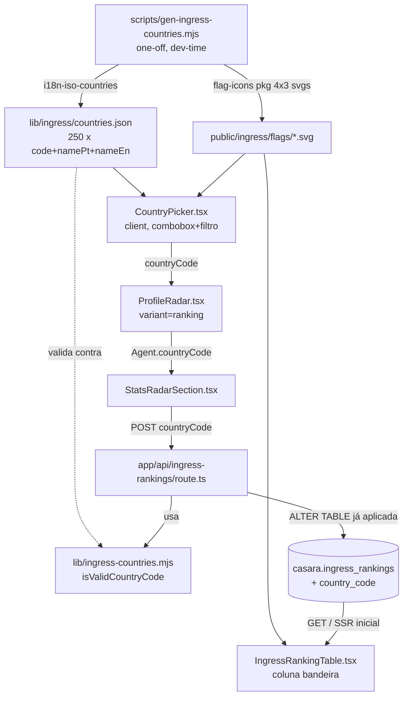

# Ingress Ranking Country Design

**Spec**: `.specs/features/ingress-ranking-country/spec.md`
**Status**: Approved

---

## Architecture Overview

Dado estático (lista de países) + assets estáticos (bandeiras SVG) entram no repo uma única vez, gerados por um script local a partir de duas libs maduras usadas só em build-time/dev-time — nunca como dependência de runtime do site, mesmo espírito do AD-001 já registrado em `.specs/STATE.md`. Em runtime, o site só lê um JSON pequeno e serve SVGs locais.



---

## Code Reuse Analysis

### Existing Components to Leverage

| Component | Location | How to Use |
| --- | --- | --- |
| `ProfileRadar` (variant `ranking`) | `components/ingress/ProfileRadar.tsx` | Estende o estado interno (`countryA`/`countryB`) e `runCompare` — não muda a API pública do componente (`onCompare` continua com a mesma assinatura). |
| `Agent` type | `components/ingress/ProfileRadar.tsx:38` | Ganha campo opcional `countryCode?: string`. |
| `StatsRadarSection.postAgent` | `components/ingress/stats/StatsRadarSection.tsx:65` | Inclui `countryCode: agent.countryCode` no body do POST. |
| `IngressRankingTable` | `components/ingress/stats/IngressRankingTable.tsx` | Nova coluna `data-col="country"`, mesmo padrão visual da coluna `faction` já existente (ícone 18×18, `title`/`alt` acessível). |
| Padrão bilíngue `T = {pt, en}` | Presente em todos os componentes de `components/ingress/` | O `CountryPicker` novo segue o mesmo padrão para placeholder/labels. |
| `rateLimitOrNull` | `lib/rate-limit.ts`, já aplicado em `POST /api/ingress-rankings` | Nenhuma mudança — o rate limit existente já cobre o payload maior. |
| `lib/ingress-rankings.mjs` | Normalização/comparação puras testáveis | Modelo a seguir para a nova `lib/ingress-countries.mjs`. |

### Integration Points

| System | Integration Method |
| --- | --- |
| `casara.ingress_rankings` | `ALTER TABLE` adiciona `country_code CHAR(2)` nullable + `CHECK` de formato; aplicada manualmente em produção, com autorização explícita antes de rodar (mesmo processo já usado para criar a tabela). |
| `POST /api/ingress-rankings` | Novo campo obrigatório `countryCode` no body; validado contra a lista fechada de 250 códigos antes de gravar. |
| `GET /api/ingress-rankings` + SELECT SSR de `app/ingress/ranking/page.tsx` | Passam a devolver `country_code` (pode ser `null`) junto das colunas já existentes. |

---

## Components

### `lib/ingress/countries.json` (dado estático)

- **Purpose**: Fonte única dos 250 países (código ISO 3166-1 alpha-2 + nome PT + nome EN).
- **Location**: `lib/ingress/countries.json`
- **Shape**: `{code: string; namePt: string; nameEn: string}[]`, ordenado por `namePt`.
- **Gerado por**: `scripts/gen-ingress-countries.mjs` (roda `i18n-iso-countries`, uma vez, versiona o resultado). Re-rodar só se a lista de códigos ISO mudar (raríssimo).
- **Reuses**: nada — é o dado-base para tudo abaixo.

### `public/ingress/flags/<cc>.svg` (assets estáticos)

- **Purpose**: Bandeira de cada país, formato 4×3 (proporção clássica, mais legível numa coluna de tabela do que o formato 1×1).
- **Location**: `public/ingress/flags/` — 250 arquivos, nome = código ISO em minúsculas (`br.svg`, `us.svg`, …).
- **Origem**: copiados de `node_modules/flag-icons/flags/4x3/` (pacote `flag-icons`, MIT) pelo mesmo script gerador — nunca linkados/baixados em runtime, mesmo princípio de "capas baixadas, não linkadas" já usado em `/livros`.
- **Reuses**: nada.

### `lib/ingress-countries.mjs` (lógica pura, testável)

- **Purpose**: Único ponto de verdade para validar/normalizar um código de país.
- **Location**: `lib/ingress-countries.mjs`
- **Interfaces**:
  - `normalizeCountryCode(code: unknown): string` — `String(code ?? '').trim().toUpperCase()`, mesmo padrão de `normalizeCodenameKey`.
  - `isValidCountryCode(code: string): boolean` — checa contra o `Set` construído de `countries.json`.
  - `COUNTRIES: {code, namePt, nameEn}[]` — reexporta o JSON para quem precisar da lista completa (API de validação e testes).
- **Dependencies**: `lib/ingress/countries.json`.
- **Reuses**: modelo direto de `lib/ingress-rankings.mjs`.

### `components/ingress/CountryPicker.tsx` (novo, client)

- **Purpose**: Combobox com filtro por digitação (nome PT/EN ou código, sem diferenciar acento/caixa) e bandeira ao lado de cada opção; mostra a bandeira do país escolhido depois de selecionado.
- **Location**: `components/ingress/CountryPicker.tsx`
- **Interfaces**:
  - `<CountryPicker id={string} value={string | null} onChange={(code: string | null) => void} invalid={boolean}>` — `value`/`onChange` no formato controlado já usado pelos textareas de `ProfileRadar` (`textA`/`setTextA`).
- **Dependencies**: `lib/ingress/countries.json`, `public/ingress/flags/*.svg`, `useLang()` (padrão bilíngue do projeto).
- **Reuses**: classes CSS `ing-radar__btn`/`ing-radar__textarea` como base visual (input com a mesma altura/borda dos campos vizinhos), padrão ARIA de combobox (novo neste componente — não existe um já no projeto para copiar, ver Risks & Concerns).
- **Client Component**: precisa de estado local (texto digitado, item ativo no teclado) — é a folha correta para `"use client"`, o componente pai (`ProfileRadar`) já é client.

### `ProfileRadar.tsx` (estendido)

- **Mudança**: dois novos estados `countryA`/`countryB` (`string | null`), inicializados `null`, resetados em `clear()`. Renderiza um `<CountryPicker>` abaixo de cada textarea visível, mas só quando `variant === 'ranking'` (a variante usada em `/ingress` não grava no banco, então não precisa de país).
- **`runCompare`**: antes do `try` de parse existente, se `variant === 'ranking'` e faltar país para qualquer agente que será submetido, seta `error` (reaproveitando o `<p className="ing-radar__compare-error">` já existente) e retorna sem chamar `onCompare` — cumpre RKCTY-03/06 sem novo mecanismo de UI.
- **Remapeamento**: o país do campo "A" segue o mesmo remapeamento que o texto já sofre hoje (`mode === 'vs-me' ? ... : toAgent(textA)` vai para `b` em `vs-me` e para `a` em `two`/`solo`) — aplicado a `countryA`/`countryB` da mesma forma para manter os dois em sincronia.

### `StatsRadarSection.postAgent` (estendido)

- **Mudança**: body do POST ganha `countryCode: agent.countryCode ?? ''`.

### `app/api/ingress-rankings/route.ts` (estendido)

- **Mudança no `POST`**: lê `countryCode`, normaliza via `normalizeCountryCode`, rejeita com 400 se vazio ou `!isValidCountryCode(...)` (RKCTY-05). Inclui a coluna no `INSERT ... ON CONFLICT DO UPDATE`.
- **Mudança no `GET`**: inclui `country_code` no `SELECT` e no objeto serializado.

### `IngressRankingTable.tsx` (estendido)

- **Mudança**: `RankingRow.country_code: string | null`; nova `<th data-col="country">` + `<td>` com `` quando presente, célula vazia quando `null` (RKCTY-07/08). Nome do país para `alt`/`title` vem de `lib/ingress/countries.json` (import estático, mesmo lookup usado pelo `CountryPicker`).

### `app/ingress/ranking/page.tsx` (estendido)

- **Mudança**: `loadInitialRows()` inclui `country_code` no `SELECT` e no objeto `RankingRow` retornado.

---

## Data Models

### `casara.ingress_rankings` (coluna nova)

```sql
ALTER TABLE casara.ingress_rankings
  ADD COLUMN IF NOT EXISTS country_code CHAR(2)
    CHECK (country_code IS NULL OR country_code ~ '^[A-Z]{2}$');
```

- **Nullable de propósito**: linhas existentes não têm país (RKCTY não preenche retroativamente, ver Out of Scope da spec). Obrigatoriedade em POSTs novos vive na API, não no schema — mesmo padrão já usado para `faction`/`codename`.
- **Sem índice novo**: não há requisito de filtrar/ordenar por país (fora de escopo).
- `lib/schema.sql` (fresh install) ganha a coluna direto na `CREATE TABLE`, para que uma instalação nova já nasça com o campo.

### `CountryOption` (TypeScript, espelha uma entrada de `countries.json`)

```typescript
interface CountryOption {
  code: string   // ISO 3166-1 alpha-2, maiúsculo, ex. "BR"
  namePt: string
  nameEn: string
}
```

**Relationships**: `Agent.countryCode` (novo campo opcional) referencia `CountryOption.code`; `RankingRow.country_code` (banco) é a mesma coisa persistida.

---

## Error Handling Strategy

| Error Scenario | Handling | User Impact |
| --- | --- | --- |
| Usuário tenta comparar/entrar sem escolher país | `runCompare` bloqueia antes do parse, seta `error` | Mensagem inline no mesmo lugar dos erros de parse existentes; nenhuma chamada de rede acontece |
| POST chega sem `countryCode` ou com código fora da lista válida | API responde 400 antes de qualquer `INSERT` | Erro tratado como falha genérica pelo client atual (`toast.error`), mesmo caminho já existente para outros 400 |
| Linha do banco sem `country_code` (dado legado) | `IngressRankingTable` renderiza célula vazia | Sem bandeira, sem erro visual, mesma linha continua completa |
| Código de país válido mas SVG ausente por engano no diretório de assets | `` quebra silenciosamente (comportamento nativo do browser) — mitigado por gerar os 250 arquivos junto da lista, nunca um subconjunto manual | Praticamente inalcançável: a lista e os arquivos vêm do mesmo script gerador na mesma execução |

---

## Risks & Concerns

| Concern | Location (file:line) | Impact | Mitigation |
| --- | --- | --- | --- |
| `ProfileRadar.runCompare` já concentra parse + telegram + callback (`components/ingress/ProfileRadar.tsx:257-273`); adicionar a validação de país aumenta essa função | `components/ingress/ProfileRadar.tsx:257` | Função um pouco mais longa, mas ainda linear e de fácil leitura | Validação fica em um bloco isolado no topo da função, antes do `try` existente — não se entrelaça com o parse |
| Nenhum combobox acessível (ARIA) existe hoje no projeto para copiar | `components/ingress/CountryPicker.tsx` (novo) | Risco de inconsistência de padrão de teclado/leitor de tela se implementado às pressas | Seguir o padrão ARIA 1.2 "combobox with list autocomplete" (input + `role="listbox"` + `aria-activedescendant`), documentado na Tasks; testável manualmente (Tab, setas, Enter, Esc) |
| `i18n-iso-countries` e `flag-icons` entram como devDependencies usadas só por um script one-off | `package.json` | Podem parecer "não usadas" numa auditoria de dependências futura | Comentário no próprio `scripts/gen-ingress-countries.mjs` explicando o propósito — mesmo padrão já aceito no projeto para `sharp` (devDependency usada só por `scripts/livros.mjs`) |
| `ALTER TABLE` em `casara.ingress_rankings`, tabela de produção já em uso real | `lib/migrations/003-ingress-ranking-country.sql` (novo) | Qualquer erro na migração afeta o ranking ao vivo | Coluna nullable, sem `DEFAULT`, sem reescrita de linhas existentes — operação de metadados rápida; aplicada só com autorização explícita antes de rodar em produção |

---

## Tech Decisions (only non-obvious ones)

| Decision | Choice | Rationale |
| --- | --- | --- |
| Formato do SVG de bandeira | 4×3 (retangular clássico), não 1×1 | Mais reconhecível como "bandeira" numa coluna estreita de tabela; `flag-icons` já fornece os dois formatos prontos |
| Onde vive a validação "país obrigatório" no client | Dentro de `runCompare`, reaproveitando `setError` | Desabilitar o botão via `canCompare` (padrão já existente) escondia o motivo do bloqueio sem uma mensagem explícita; a spec pede indicação visual do motivo |
| `i18n-iso-countries`/`flag-icons` como devDependencies, não dependencies | Rodam só em `scripts/gen-ingress-countries.mjs`, nunca importadas por código do site | Consistente com AD-001 (dado estável de feature-vitrine = arquivo local, não dependência viva) e com o padrão já aceito para `sharp` |
| Nome do país no `alt`/`title` da bandeira da tabela | Lookup em `lib/ingress/countries.json` pelo `country_code`, não guardado de novo na linha do banco | Evita duplicar o nome do país em duas fontes de verdade (banco guarda só o código, é o padrão ISO — o nome é sempre derivado) |

---

## Tasks preview

~14-16 tasks atômicas esperadas (dado + assets + lib pura + migração + API + componente novo + 3 componentes estendidos + testes). Acima do limiar de "implicit nos passos do Execute" (>5 passos) → segue para a fase Tasks formal.
