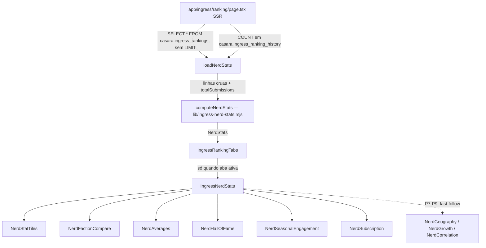

# Estatísticas para Nerds Design

**Spec**: `.specs/features/ingress-ranking-nerd-stats/spec.md`
**Status**: Approved

---

## Architecture Overview

Terceira aba em `IngressRankingTabs` (`'ranking' | 'activity' | 'nerd'`), ao lado das duas já existentes. Ao contrário delas, não há client-side fetch/poll: `app/ingress/ranking/page.tsx` ganha um terceiro loader SSR (`loadNerdStats`) que busca **todas** as linhas de `casara.ingress_rankings` (sem `LIMIT`, ao contrário de `loadInitialRows`) mais `COUNT(*)` de `casara.ingress_ranking_history`, e passa o resultado já pronto (`NerdStats`) como prop. Todo o cálculo — contagem de tiers por stat, hall da fama, histograma, médias, eventos sazonais — acontece uma única vez, em Node, dentro de um módulo puro novo e testado (`lib/ingress-nerd-stats.mjs`), reaproveitando `computeStatTiers`/`RADAR_AXES` já existentes em vez de duplicar limiares de tier em SQL.



**Por que essa abordagem (não SQL agregado, não híbrido)**: o volume real da tabela é dezenas de linhas (ver Out of Scope da spec, que já rejeita view materializada pelo mesmo motivo). Contagem de tier por stat depende de `computeBadge`/`computeStatTiers`, que já vivem em JS e são a fonte única dos limiares — reimplementar isso em SQL (`CASE WHEN stat_values->>'x' >= ...`) duplicaria regra de negócio em dois lugares que podem divergir. Hall da fama por stat (12 `MAX` + tie-break por `created_at`) também é mais simples e mais testável em JS puro do que em 12 subqueries SQL sem cobertura de teste unitário. Buscar tudo de uma vez e agregar em Node é o caminho mais barato em código E o mais alinhado ao padrão já estabelecido do projeto (lógica pura testada em `.mjs`, como `ingress-tier-score.mjs`, `ingress-badges.mjs`, `book-utils.mjs`).

---

## Code Reuse Analysis

### Existing Components to Leverage

| Component | Location | How to Use |
| --- | --- | --- |
| `computeStatTiers` | `lib/ingress-tier-score.mjs` | Chamado 1x por agente dentro de `computeNerdStats` para contar tiers concedidos (P1) e detectar o "clube Onyx" (12/12 onyx) |
| `RADAR_AXES` / `RADAR_STAT_KEYS` | `lib/ingress-radar.mjs`, `lib/ingress-compare-message.mjs` | Fonte dos 12 stats/5 eixos para hall da fama, contagem de tiers e radar médio |
| `fmtStat` | `lib/ingress-format.mjs` | Formatação de números nos stat tiles/hall da fama, mesmo padrão do resto de `/ingress` |
| `COUNTRIES`/`flagSrc` | `lib/ingress-countries.mjs` | Bandeiras na seção de geografia (P7) |
| `FACTION_ICON` (padrão já usado em `IngressActivityFeed.tsx`) | inline | Reaproveitar o mesmo par de ícones de facção na comparação (P2), não recriar |
| `ing-radar__shape`/`ing-radar__ring` (classes CSS) | `app/ingress/theme.css` (via `ProfileRadar.tsx`) | Visual do radar médio da comunidade (P3) sem importar `ProfileRadar` inteiro (ver Risco 1) |
| Padrão "Sinal perdido" (`Panel label="Sinal perdido"`) | `app/ingress/ranking/page.tsx:164-170` | Estado vazio da aba (P1 AC7, Edge case) |
| Migration `005-ingress-ranking-recursions.sql` | `lib/migrations/` | Template direto para a migration de `months_subscribed` (mesmo padrão: nullable, `CHECK >= 0`, `ADD COLUMN IF NOT EXISTS`) |

### Integration Points

| System | Integration Method |
| --- | --- |
| `casara.ingress_rankings` | Nova leitura sem `LIMIT` (todas as colunas já existentes + `months_subscribed` novo) dentro de `loadNerdStats`, direto via `sql` (`lib/db.ts`) — mesmo padrão de `loadInitialRows` |
| `casara.ingress_ranking_history` | `COUNT(*)` simples, mesma tabela já lida por `loadInitialActivity` |
| `POST /api/ingress-rankings` | Ganha um campo opcional a mais (`monthsSubscribed`), mesmo tratamento não-rejeitante de `recursions` |

---

## Components

### `lib/ingress-nerd-stats.mjs` (novo)

- **Purpose**: Núcleo puro — recebe as linhas cruas do ranking + total de envios, devolve o objeto `NerdStats` inteiro. Sem I/O, sem Next, testável via `node --test`.
- **Location**: `lib/ingress-nerd-stats.mjs` + `lib/ingress-nerd-stats.test.mjs`
- **Interfaces**:
  - `computeNerdStats(rows: AgentRow[], totalSubmissions: number): NerdStats`
- **Dependencies**: `computeStatTiers`, `RADAR_AXES`, `RADAR_STAT_KEYS`
- **Reuses**: `computeStatTiers` (tier por stat), `RADAR_AXES` (eixos/partes)

### `loadNerdStats` (novo, dentro de `app/ingress/ranking/page.tsx`)

- **Purpose**: Busca SSR das linhas cruas + total de envios, chama `computeNerdStats`, degrada para estado vazio em erro — mesmo formato de `loadInitialRows`/`loadInitialActivity` já existentes no mesmo arquivo.
- **Interfaces**: `async function loadNerdStats(): Promise<NerdStats | null>`
- **Reuses**: `sql` de `lib/db.ts`, mesmo `try/catch` + `console.error` das duas funções irmãs

### `IngressRankingTabs.tsx` (modificado)

- **Purpose**: Ganha a terceira aba `'nerd'`. Continua montando só a aba ativa (evita computar/renderizar as três de uma vez).
- **Location**: `components/ingress/stats/IngressRankingTabs.tsx`
- **Interfaces**: prop nova `nerdStats: NerdStats | null`
- **Reuses**: estrutura de `role="tablist"` já existente, só acrescenta um terceiro botão

### `IngressNerdStats.tsx` (novo, orquestrador)

- **Purpose**: Renderiza as seções P1-P6 (e P7-P9 como fast-follow) a partir de `NerdStats` já calculado — sem fetch próprio, sem poll. Client leaf só por `useLang()`, mesmo padrão de `IngressFooter`/`IngressHub`.
- **Location**: `components/ingress/stats/IngressNerdStats.tsx`
- **Interfaces**: `({stats}: {stats: NerdStats | null}) => JSX.Element`
- **Reuses**: padrão "Sinal perdido" para `stats === null` ou `stats.totalAgents === 0`

### Sub-componentes de seção (novos, todos puramente apresentacionais, recebem a fatia de `NerdStats` que precisam)

| Componente | Seção da spec | Nota |
| --- | --- | --- |
| `NerdStatTiles.tsx` | P1 — totais | Grade de 6 tiles (agentes, AP total, envios, tiers concedidos, Onyx concedidos, clube Onyx) |
| `NerdFactionCompare.tsx` | P2 — facção | Barras divergentes; reaproveita `FACTION_ICON` |
| `NerdAverages.tsx` | P3 — médias/distribuição | Histograma (barras simples SVG) + `CommunityRadarChart` (novo, ver abaixo) + bloco de recursões |
| `CommunityRadarChart.tsx` | P3 — radar consolidado | Ver "Risco 1" — polígono read-only, reaproveita classes CSS de `ProfileRadar`, não o componente |
| `NerdHallOfFame.tsx` | P4 — recordes | Lista dos 12 stats + AP + recursões, cada um com codinome+valor |
| `NerdSeasonalEngagement.tsx` | P5 — eventos sazonais | 9 métricas, cada uma com soma + "N agentes informaram" + aviso de dado parcial |
| `NerdSubscription.tsx` | P6 — assinatura | % + média, ou "sem dados suficientes" |
| `NerdGeography.tsx` (fast-follow) | P7 | Lista de países por contagem |
| `NerdGrowth.tsx` (fast-follow) | P8 | Linha cumulativa semanal (SVG, mesmo estilo de `AgentHistoryChart`) |
| `NerdCorrelation.tsx` (fast-follow) | P9 | Dispersão AP×nota (SVG) + eixo mais fraco |

Todos vivem em `components/ingress/stats/` (flat, igual ao resto da pasta — o volume de componentes não justifica uma subpasta `nerd/` própria).

### `POST /api/ingress-rankings` (modificado)

- **Purpose**: Aceita `monthsSubscribed` opcional, grava em `months_subscribed`, mesmo tratamento não-rejeitante de `recursions` (linhas 184-185 do arquivo atual).
- **Location**: `app/api/ingress-rankings/route.ts`

---

## Data Models

### Migration `009-ingress-ranking-months-subscribed.sql` (novo)

```sql
ALTER TABLE casara.ingress_rankings
  ADD COLUMN IF NOT EXISTS months_subscribed INTEGER
    CHECK (months_subscribed IS NULL OR months_subscribed >= 0);
```

Mesmo padrão exato de `005-ingress-ranking-recursions.sql`: nullable, sem exigir em POSTs novos, linhas existentes nascem `NULL`.

### `NerdStats` (TypeScript, tipo de retorno de `computeNerdStats`, consumido pelos componentes)

```typescript
type TierCounts = {bronze: number; silver: number; gold: number; platinum: number; onyx: number}

type StatRecord = {codenameKey: string; codename: string; value: number} | null

interface NerdStats {
  totals: {
    totalAgents: number
    totalLifetimeAp: number
    totalSubmissions: number
    badgeTiersGranted: TierCounts
    onyxBadgesGranted: number
    onyxClubCount: number
  }
  byFaction: Record<'enlightened' | 'resistance', {
    agentCount: number
    totalAp: number
    avgOverallScore: number
    onyxBadges: number
  }>
  averages: {
    avgApPerAgent: number
    overallScoreHistogram: {label: string; min: number; max: number | null; count: number}[] // 6 faixas
    communityAxisAverage: Record<string, number> // 5 eixos
    recursions: {avg: number | null; max: number | null; reportedCount: number}
  }
  hallOfFame: {
    perStat: Record<string, StatRecord> // 12 chaves de RADAR_STAT_KEYS
    lifetimeAp: StatRecord
    recursions: StatRecord
  }
  seasonalEngagement: Record<string, {sum: number; reportedCount: number}> // 9 chaves
  subscription: {hasData: boolean; percentSubscribed: number | null; avgMonthsAmongSubscribed: number | null}
  geography: {countryCode: string; count: number}[] // fast-follow
  growth: {weekStart: string; cumulativeCount: number}[] // fast-follow
  correlation: {points: {codenameKey: string; ap: number; score: number}[]; weakestAxisId: string} // fast-follow
}
```

**Relationships**: `NerdStats` é derivado inteiramente das linhas de `casara.ingress_rankings` (todas, sem paginação) + um único número (`totalSubmissions` de `casara.ingress_ranking_history`). Não persiste nada — recalculado a cada carregamento da página (`force-dynamic`, já vigente na rota).

---

## Error Handling Strategy

| Error Scenario | Handling | User Impact |
| --- | --- | --- |
| `casara.ingress_rankings` inacessível (tabela ainda não migrada, erro de conexão) | `loadNerdStats` captura e retorna `null`, mesmo padrão de `loadInitialRows`/`loadInitialActivity` | `IngressNerdStats` renderiza o mesmo painel "Sinal perdido" já usado alhures |
| `casara.ingress_ranking_history` vazia mas `ingress_rankings` tem linhas | `totalSubmissions` fica `0`, resto do cálculo segue normal | Tile "Total de envios" mostra 0, demais tiles corretos |
| `stat_values` com chave ausente/não-numérica | Tratado como `0` dentro de `computeNerdStats` (mesmo comportamento de `computeStatTiers`/`computeBadge` já em produção) | Hall da fama e contagem de tiers nunca quebram por um dado malformado |
| `extra_stats` sem uma chave sazonal específica | Excluído do somatório E do divisor daquela métrica (nunca vira 0) | Contador "N agentes informaram" reflete a amostra real |
| `months_subscribed` todo `NULL` (antes do deploy da migration) | `subscription.hasData = false` | UI mostra "sem dados suficientes" em vez de 0%/média zerada |
| 0 agentes cadastrados | `computeNerdStats` retorna totais zerados; página decide exibir estado vazio antes de renderizar seções | Mensagem graciosa, sem tiles quebrados |

---

## Risks & Concerns

| Concern | Location (file:line) | Impact | Mitigation |
| --- | --- | --- | --- |
| `ProfileRadar.tsx` é um componente grande e stateful (paste, comparação, toasts) — importar ele inteiro só para desenhar 1 polígono médio acoplaria a aba nerd a lógica que não usa | `components/ingress/ProfileRadar.tsx:207-379` | Complexidade/acoplamento desnecessário, risco de quebrar a aba nerd em mudanças futuras do fluxo de comparação | Criar `CommunityRadarChart.tsx` novo, presentational-only, reaproveitando as classes CSS (`ing-radar__shape` etc.) para paridade visual, não o componente |
| `extra_stats` é JSONB nunca validado (formato livre vindo do cliente) | `lib/migrations/006-ingress-ranking-extra-stats.sql:17` | Uma chave sazonal com valor não-numérico (string, objeto) poderia contaminar a soma | `computeNerdStats` usa `Number.isFinite` antes de somar; valor não-numérico é tratado como "não informado", igual chave ausente |
| Fetch sem `LIMIT` de `casara.ingress_rankings` a cada carregamento de `/ingress/ranking` (rota já é `force-dynamic`) | `app/ingress/ranking/page.tsx:15` | Cresce linearmente com o ranking; hoje trivial (dezenas de linhas) | Aceito por escopo — a própria spec já rejeita view materializada pelo mesmo motivo (Out of Scope); revisitar só se o volume mudar de ordem de grandeza |
| Migration de coluna precisa ser aplicada em produção manualmente (Neon SQL Editor) antes do deploy do código que lê `monthsSubscribed` | `lib/migrations/009-*.sql` (novo) | Deploy fora de ordem faria o `POST` gravar em coluna inexistente | Mesmo processo já usado nas migrations 003/005/006: aplicar primeiro, com autorização explícita do Luiz, antes do merge/deploy do código |

---

## Tech Decisions

| Decision | Choice | Rationale |
| --- | --- | --- |
| Bandas do histograma | Calculadas direto sobre `overall_score` (0/20/40/60/80/100/120+) | A spec já define os cortes exatos; não precisa de `tierPosition`, é aritmética simples |
| Tie-break do hall da fama | Mesmo critério de `compareRankingRows`: valor maior vence, empate exato resolvido por `created_at` mais antigo | Consistência com o desempate já usado na ordenação do ranking principal |
| Onde os componentes de seção vivem | Flat em `components/ingress/stats/`, sem subpasta `nerd/` | Segue o padrão atual da pasta (flat); volume (9-10 arquivos pequenos) não justifica aninhamento, ao contrário de `quiz-ao-vivo/` (que tem builder+control panel+lógica bem maior) |
| Radar médio da comunidade | Componente novo `CommunityRadarChart.tsx`, não reaproveita `ProfileRadar` | Ver Risco 1 |
| P7-P9 (geografia/crescimento/correlação) | Incluídos no design, mas tratados como fast-follow na fase Tasks (não bloqueiam o MVP) | Não têm ⭐ MVP na spec; P1-P6 é o corte de MVP confirmado |

> Nenhuma decisão aqui conflita com `AD-001`/`AD-002` (ambas sobre a fonte de dado de `/ingress` raiz) — esta feature só estende o padrão já vigente de `/ingress/ranking` (DB-backed, SSR direto). Nenhum novo AD necessário.

---

## Tips

(seção de referência da skill, não repetida aqui)
