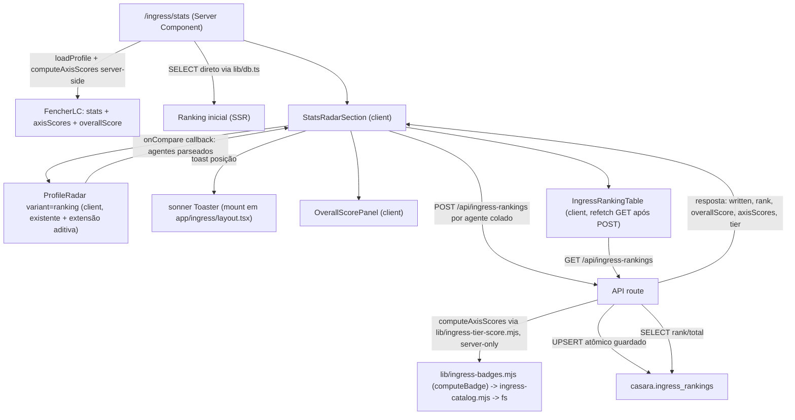

# Ingress Stats & Ranking Design

**Spec**: `.specs/features/ingress-stats-ranking/spec.md`
**Status**: Draft

---

## Leitura de `.specs/STATE.md`

**AD-001** ("feature de vitrine de dono único pode usar arquivo versionado em vez de tabela `casara`") continua `active`, mas seu próprio campo `Scope` já exclui explicitamente este caso: *"NÃO se aplica a nada com múltiplos escritores... esses continuam em `casara.*`"*. `casara.ingress_rankings` é multi-escritor por definição (qualquer visitante grava sua própria linha) — **conforma** com AD-001 sem precisar supersedê-la; na verdade a valida. Nenhuma nova AD é necessária para essa parte.

Nenhuma lição confirmada com escopo `ingress` ainda existe (`lessons.py list --status confirmed` vazio).

---

## Architecture Overview

Duas peças que já existem continuam intactas e ganham uma camada nova por cima:

- **Radar existente** (`components/ingress/ProfileRadar.tsx`) — parsing + comparação client-side — ganha um modo novo aditivo (`variant="ranking"`), gated por prop, zero mudança de comportamento no uso atual de `/ingress`.
- **Cálculo de nota geral** é uma peça inteiramente nova, e **só roda no servidor** (decisão confirmada) — os limiares completos de tier só são legíveis via `node:fs` (`lib/ingress-catalog.mjs`), então o cliente nunca computa a nota sozinho; ele manda os stats brutos, o servidor computa e persiste atomicamente, e devolve nota + posição no mesmo request.



---

## Code Reuse Analysis

### Existing Components to Leverage

| Component | Location | How to Use |
| --- | --- | --- |
| `ProfileRadar` | `components/ingress/ProfileRadar.tsx` | Estender aditivamente: nova prop `variant?: 'default' \| 'ranking'`, novo modo `'solo'`, nova prop `onCompare`. Uso atual em `/ingress` (sem `variant`) fica byte-a-byte idêntico. |
| `parseAppExport` | `lib/ingress-stats.mjs` | Reaproveitado sem mudança — já é o parser client-safe usado tanto pelo radar existente quanto pelo novo POST (o cliente parseia antes de mandar só os campos que interessam). |
| `computeRadarAxes`, `compareRadar` | `lib/ingress-radar.mjs` | Inalterados — continuam sendo a fonte do desenho do polígono (forma visual, baseada só em razão-Onyx). A nova nota geral é uma camada adicional, não substitui isso. |
| `RADAR_AXES` (estrutura dos 5 eixos/12 stats) | `lib/ingress-radar.mjs` | Reaproveitada como a estrutura de agrupamento pro novo módulo de score — mesmos 5 eixos, mesmos 12 `statKey`s, só troca a fonte do limiar (de `ref` fixo pra tiers do catálogo). |
| `BADGES`, `computeBadge` | `lib/ingress-badges.mjs` | **Achado principal da revisão de design** — `computeBadge` já interpola tier+progresso+overflow-pós-Onyx (`beyond.multiple`/`beyond.pct`), matematicamente igual à extensão linear fechada com o usuário. `lib/ingress-tier-score.mjs` (novo) só converte essa saída num número contínuo, não recalcula tiers do zero. É essa cadeia (`ingress-badges.mjs` → `ingress-catalog.mjs` → `fs`) que torna o novo módulo server-only — motivo raiz de "nota só no servidor". |
| `TIER_LABELS`, `TIER_COLOR`, `TIER_RANK` | `lib/ingress-tiers.mjs` | Reaproveitados pro selo de tier geral (Bronze..Onyx) na visão do próprio perfil e pra converter `tier` em posição numérica (`TIER_RANK[tier]`). |
| `loadProfile()` | `lib/ingress.ts` | Fonte do baseline do FencherLC (build-time, sem I/O em runtime) — nunca é sobrescrito pela rota pública. |
| `lib/db.ts` (`sql` tagged template) | `lib/db.ts` | Mesmo client lazy usado por `/api/quiz-sessions`, `/api/word-sessions` etc. — sem camada de repositório nova. |
| `context/LanguageContext.tsx` (`useLang`) | já montado no `app/layout.tsx` raiz | **Zero mudança de infraestrutura** — o provider já envolve `/ingress` hoje (é uma rota aninhada). Só falta consumo. |
| Padrão `translations = {pt:{...}, en:{...}}` | `app/about/page.tsx`, `app/app/page.tsx` | Mesmo padrão aplicado a cada componente novo que precisa de texto traduzido (client leaf, `const {lang} = useLang(); const t = translations[lang]`). |
| `Panel` | `components/ingress/Panel.tsx` (usado por `ProfileRadar`) | Reaproveitado como wrapper visual consistente pros novos painéis (`AxisExplanations`, `OverallScorePanel`, `IngressRankingTable`, tutorial). |
| `notifyTelegram` (fire-and-forget POST, dedupe por hash em `localStorage`, gate `NODE_ENV==='production'`) | `components/ingress/ProfileRadar.tsx:52-84` | Mesmo *padrão* (não o código) replicado pro novo POST de ranking: fire-and-forget, sem bloquear a UI, sem lançar erro visível. |
| `Header.tsx` guarda de rota (`pathname.startsWith('/ingress')` → retorna `null`) | `components/Header.tsx:102` | **Achado relevante**: o toggle PT/EN do resto do site não aparece em `/ingress` porque o `Header` inteiro não renderiza ali. Precisa de um toggle novo, próprio da área (ver Componentes). |

### Integration Points

| System | Integration Method |
| --- | --- |
| `casara` (Neon) | Nova tabela `casara.ingress_rankings`, acessada via `lib/db.ts` direto na rota de API (mesmo padrão de `/api/quiz-sessions`) — primeira vez que `/ingress` toca o banco. |
| `data/ingress/badge-catalog.json` | Lido só no servidor via `lib/ingress-catalog.mjs` (já existe, `fs`-based) — nenhuma mudança nesse arquivo. |
| `utils/analytics.ts` | Novas funções `trackIngress*` numa seção nova, seguindo o padrão de "toda feature nova ganha sua seção" já documentado. |
| `sonner` (nova dependência) | `<Toaster/>` montado em `app/ingress/layout.tsx` (Server Component continua Server Component — renderizar um Client Component filho não propaga `"use client"` pro pai). `toast()` chamado de dentro do novo componente client que orquestra o POST. |

---

## Components

### `lib/ingress-tier-score.mjs` (novo, server-only, lógica pura)

- **Purpose**: computa a posição-de-tier interpolada de um stat, a nota de cada eixo, e a nota geral.
- **Achado na revisão do design (corrige o plano original)**: `lib/ingress-badges.mjs` **já calcula exatamente essa matemática** via `computeBadge(badgeDef, value)` — devolve `tier`/`pct` (progresso 0..1 até o próximo tier) e, quando `atMax` (chegou no Onyx), `beyond.multiple`/`beyond.pct` (progresso dentro da "dobra" atual, ex. Onyx ×2 → ×3). Testado em `lib/ingress-badges.test.mjs` (edge cases de limiar exato, valor 0, além do Onyx). Isso é matematicamente idêntico à extensão linear `5 + (razão − 1)` fechada com o usuário: em `value = 2×onyx`, `beyond.multiple=2, beyond.pct=0` → posição `5 + (2-1) + 0 = 6`, igual a `5 + (2-1)`. **Este módulo novo não recalcula tiers do zero — só converte a saída de `computeBadge` num número contínuo e agrega pelos 5 eixos.**
- **Location**: `lib/ingress-tier-score.mjs`
- **Interfaces**:
  - `tierPosition(badgeResult: ReturnType<computeBadge>): number` — `TIER_RANK[badgeResult.tier] + (badgeResult.pct ?? 0)` quando não `atMax`; `5 + (badgeResult.beyond.multiple - 1) + badgeResult.beyond.pct` quando `atMax`.
  - `computeAxisScores(stats: Record<string, number>): {id, label, score}[]` — para cada eixo de `RADAR_AXES`, resolve o `badgeDef` de cada parte via `BADGES.find(b => b.slug === part.badge)`; para `portalsNeutralized` (única parte sem `badge` própria) usa um `badgeDef` sintético construído uma vez a partir de `BADGES.find(b => b.slug === 'purifier').tiers`, cada limiar ÷ 8 — mesma aproximação que `RADAR_AXES` já usa pro `ref` dessa parte. Eixo = média das `tierPosition` das suas partes.
  - `computeOverallScore(axisScores): number` — média dos 5 `axisScores[].score` × 20.
  - `overallTierLabel(axisScores, lang): string` — piso da média das posições → `TIER_LABELS[...]` de `lib/ingress-tiers.mjs`, com sufixo `+N` quando além do Onyx (`floor(avg) - 5`, se > 0).
- **Dependencies**: `lib/ingress-badges.mjs` (`BADGES`, `computeBadge`, `TIER_RANK` — que por sua vez importa `lib/ingress-catalog.mjs`, `fs`-based; é essa cadeia, não uma nova, que faz este módulo ser server-only), `lib/ingress-radar.mjs` (`RADAR_AXES`, só a estrutura de agrupamento), `lib/ingress-tiers.mjs`.
- **Reuses**: `computeBadge` inteiro (matemática de tier já validada); `RADAR_AXES` (grouping); zero leitura direta de `badge-catalog.json` ou de `lib/ingress-catalog.mjs` — passa a acessar tudo via `lib/ingress-badges.mjs`, a mesma camada que `MedalGrid`/`MedalDetail` já usam hoje.
- **Testado** via `node --test`, mesmo padrão dos outros `.mjs` do projeto (é lógica pura, sem I/O de rede).

### `app/api/ingress-rankings/route.ts` (novo)

- **Purpose**: único ponto de escrita/leitura da tabela — upsert guardado por debounce + leitura pública do leaderboard.
- **Location**: `app/api/ingress-rankings/route.ts`
- **Interfaces**:
  - `POST` — body `{codename, faction, lifetimeAp, stats: {...12 chaves...}}`.
    1. Normaliza `codename_key = codename.trim().toLowerCase()`.
    2. IF `codename_key === FENCHERLC_KEY` (constante derivada de `loadProfile().agent.codename`) THEN **não roda nenhum SQL de escrita** — só lê a linha existente do FencherLC (seedada uma vez, fora da API) pra devolver rank atual; responde `{written:false, ...}`. Mesmo formato de resposta do caso de debounce (unifica os dois guardas numa única forma de resposta "não escrevi, aqui está o que já existe").
    3. Senão, chama `computeAxisScores`/`computeOverallScore` (server-side) e executa o upsert atômico guardado (ver Data Models).
    4. `SELECT COUNT(*) + 1 WHERE overall_score > $1 OR (overall_score = $1 AND lifetime_ap > $2) OR (...)` pra posição, e `SELECT COUNT(*)` pro total.
    5. Responde `{written: boolean, rank: number, totalAgents: number, overallScore: number, axisScores: {...}, tier: string}`.
  - `GET` — `?limit=100` (default 100, hard cap 100). `Cache-Control: s-maxage=20, stale-while-revalidate=40` (janela curta, decisão confirmada). Sem token.
- **Dependencies**: `lib/db.ts`, `lib/ingress-tier-score.mjs`, `lib/ingress.ts` (`loadProfile` pra saber o codinome do FencherLC).
- **Reuses**: mesmo padrão de handler de outras rotas (`app/api/quiz-sessions/[id]/answers/route.ts` como referência de "uma instrução SQL atômica guardada, sem leitura-antes-de-escrever").

### `components/ingress/ProfileRadar.tsx` (modificado — aditivo)

- **Purpose**: inalterado (radar + comparação client-side); ganha um modo e um hook de saída.
- **Mudanças**:
  - Nova prop `variant?: 'default' | 'ranking'` (default `'default'` → comportamento 100% preservado).
  - Nova prop `onCompare?: (agents: {a: Agent; b?: Agent}) => void`, chamada no mesmo ponto que `notifyTelegram` já é chamada hoje em `runCompare` (linha ~155) — **só quando `variant==='ranking'`**.
  - `mode` ganha um terceiro valor `'solo'` (só quando `variant==='ranking'`): `runCompare` faz `const a = toAgent(textA); setCmp({a})` — sem `b`. Requer afrouxar o tipo `cmp` de `{a: Agent; b: Agent}` para `{a: Agent; b?: Agent}` (o código de renderização já trata `agentB`/`bAxes` como opcional em vários pontos — mudança de tipo, não de lógica de render).
  - Quando `variant==='ranking'`: caixa de comparação abre por padrão (`open` inicial `true`), e os rótulos dos botões de modo mudam pra "Comparar com {agentName}" / "Comparar com outro agente" / "Só entrar no ranking" (as 3 chamadas do spec).
- **Reuses**: tudo mais — parsing, SVG, breakdown por eixo — inalterado.

### `components/ingress/stats/StatsRadarSection.tsx` (novo, client)

- **Purpose**: orquestra o fluxo de ranking em cima do `ProfileRadar` — é o único lugar que fala com `/api/ingress-rankings` no caminho de escrita.
- **Location**: `components/ingress/stats/StatsRadarSection.tsx`
- **Interfaces**: `StatsRadarSection({fencherlc: {stats, agentName, capturedAt, axisScores, overallScore, tier}})`.
  - `handleCompare({a, b})`: decide quais agentes foram efetivamente colados (nunca o `me`/FencherLC vindo de prop) — `mode==='vs-me' → [b]`, `'two' → [a, b]` (posição do toast = a, "primeiro colado"), `'solo' → [a]`. Para cada um, `POST /api/ingress-rankings`. Em paralelo (`Promise.allSettled`, uma falha de rede não trava a outra).
  - Em cada resposta: atualiza o estado local que alimenta `OverallScorePanel`; dispara `toast()` (sonner) com a posição do agente "principal" daquele caminho (regra "primeiro colado" — assumption já registrada no spec); em caso de falha de rede (não resposta, não "debounced") mostra um toast suave de erro (Edge case do spec).
  - Após qualquer POST resolvido com `written:true`, dispara um refetch do `IngressRankingTable` (via um contador/estado compartilhado simples — sem lib de data-fetching nova).
- **Dependencies**: `ProfileRadar` (`variant="ranking"`), `sonner` (`toast`), `OverallScorePanel`.
- **Reuses**: `ProfileRadar` inteiro; nenhuma lógica de parsing/radar duplicada.

### `components/ingress/stats/OverallScorePanel.tsx` (novo, client)

- **Purpose**: mostra a nota geral + selo de tier + a nota individual de cada um dos 5 eixos (ISTATS-03/04/27) — o "formato do jogo" em número, não só em forma.
- **Location**: `components/ingress/stats/OverallScorePanel.tsx`
- **Interfaces**: `OverallScorePanel({agents: {label: string; overallScore: number; axisScores: Record<string, number>; tier: string}[]})` — aceita 1 ou 2 agentes (mesmo padrão a/b do radar) pra permitir leitura lado-a-lado quando há comparação.
- **Dependencies**: `useLang()` (rótulos dos 5 eixos e do selo), `TIER_LABELS`/`TIER_COLOR` de `lib/ingress-tiers.mjs`.

### `components/ingress/stats/AxisExplanations.tsx` (novo, client leaf)

- **Purpose**: ISTATS-02 — texto fixo abaixo do gráfico explicando cada um dos 5 eixos (não depende de nenhum estado de comparação, é sempre o mesmo texto).
- **Dependencies**: só `useLang()` — é client unicamente por causa disso (nenhum evento, nenhum efeito).

### `components/ingress/stats/IngressRankingTable.tsx` (novo, client)

- **Purpose**: ISTATS-15/16/29 — lista completa, ordenada, com ícone de "olho" (popover) mostrando os 12 valores brutos por eixo.
- **Interfaces**: recebe `initialRows` (SSR, da query direta feita em `page.tsx`) como prop inicial; refaz `GET /api/ingress-rankings` quando `StatsRadarSection` sinaliza uma escrita nova.
- **Dependencies**: `useLang()` (cabeçalhos), `fmtStat` de `lib/ingress-format.mjs` (reaproveitado pra formatar os números do popover, mesmo formatador já usado no breakdown do radar).

### `components/ingress/stats/IngressLanguageToggle.tsx` (novo, client leaf)

- **Purpose**: ISTATS-18 — a "chave" de troca PT/EN visível dentro da área `/ingress`, já que `Header.tsx` não renderiza ali.
- **Location**: montado em `app/ingress/layout.tsx` (Server Component — renderizar este filho client não o transforma em client).
- **Interfaces**: nenhuma prop — só `const {lang, toggle} = useLang()`.
- **Reuses**: o mesmo contexto que o resto do site já usa; visualmente estilizado com o tema Sora/Barlow de `app/ingress/theme.css`, não com as classes do `Header` genérico.

### `components/ingress/stats/IngressTutorial.tsx` (novo, client leaf)

- **Purpose**: ISTATS-22 — passo-a-passo numerado + placeholder de imagem.
- **Dependencies**: `useLang()`.

### `components/ingress/stats/IngressSuggestionLink.tsx` (novo — pode ser Server Component)

- **Purpose**: ISTATS-23 — link estático pro Telegram. Como é só um `<a href="https://t.me/FencherLC" target="_blank">`, **não precisa de `"use client"`** — único texto (rótulo do link) pode entrar como prop vinda de um pai que já resolve `lang`, ou viver dentro do `IngressTutorial` client leaf para simplificar (decisão de Tasks, não estrutural).

### `app/ingress/stats/page.tsx` (novo, Server Component)

- **Purpose**: monta a página — carrega o baseline do FencherLC, computa a nota dele no servidor, busca a lista inicial do ranking direto no banco (sem se autochamar via `fetch`), e compõe os componentes acima.
- **Reuses**: `loadProfile()`, `computeAxisScores`/`computeOverallScore` (novo módulo), `sql` de `lib/db.ts` direto (evita um round-trip de rede pra si mesmo no primeiro paint).

---

## Data Models

```sql
-- ─── Ingress Stats & Ranking ────────────────────────────────────────────────

CREATE TABLE IF NOT EXISTS casara.ingress_rankings (
  codename_key   TEXT PRIMARY KEY,
  codename       TEXT NOT NULL,
  faction        TEXT NOT NULL CHECK (faction IN ('enlightened','resistance')),
  lifetime_ap    BIGINT NOT NULL DEFAULT 0,
  overall_score  NUMERIC(7,2) NOT NULL,
  axis_scores    JSONB NOT NULL,
  stat_values    JSONB NOT NULL,
  created_at     TIMESTAMPTZ NOT NULL DEFAULT NOW(),
  updated_at     TIMESTAMPTZ NOT NULL DEFAULT NOW()
);

CREATE INDEX IF NOT EXISTS idx_ingress_rankings_score ON casara.ingress_rankings (overall_score DESC);
CREATE INDEX IF NOT EXISTS idx_ingress_rankings_ap    ON casara.ingress_rankings (lifetime_ap DESC);
```

```typescript
// lib/ingress-tier-score.mjs (JSDoc — o projeto usa .mjs + JSDoc pra lógica pura, não .ts)
interface AxisScore { id: string; label: string; score: number } // score = posição de tier, pode passar de 5
interface RankingRow {
  codenameKey: string
  codename: string
  faction: 'enlightened' | 'resistance'
  lifetimeAp: number
  overallScore: number
  axisScores: Record<string, number>   // 5 chaves: construcao, destruicao, exploracao, hacking, linksCampos
  statValues: Record<string, number>   // 12 chaves: os stats usados nas 5 pontas
  createdAt: string  // ISO — "medido desde"
  updatedAt: string  // ISO
}
```

**Relationships**: tabela independente, sem FK — não referencia nenhuma outra tabela `casara.*` (não é uma sessão, não tem dono/host). `codename_key` é a única chave de identidade.

---

## Error Handling Strategy

| Error Scenario | Handling | User Impact |
| --- | --- | --- |
| Texto colado não parseia (`parseAppExport` lança) | `ProfileRadar` já trata isso hoje (`catch` em `runCompare`, `setError`) — comportamento inalterado, `onCompare` nunca é chamado | Mensagem de erro inline já existente, nenhum POST é tentado |
| Debounce ativo (agente atualizado há < 5 min) | `WHERE updated_at < NOW() - INTERVAL '5 minutes'` no `ON CONFLICT DO UPDATE` não casa → 0 linhas afetadas; rota faz um `SELECT` de leitura pura pra devolver o estado atual | `written:false`, toast normal com a posição já salva, sem erro visível |
| Tentativa de escrever a linha do FencherLC | Guarda explícita antes de qualquer SQL de escrita (comparação de `codename_key`) | Mesmo formato de resposta do debounce — nenhuma diferença visível pro usuário |
| Neon indisponível / erro de rede no POST | `try/catch` no `fetch` de `StatsRadarSection`; radar e comparação já renderizados localmente continuam de pé | Toast suave de falha ("não foi possível atualizar seu registro agora"), UI não trava |
| `GET /api/ingress-rankings` falha (ex. timeout) | `IngressRankingTable` mantém `initialRows` (da SSR) como fallback, sem re-lançar erro pra árvore | Tabela mostra o último dado bom conhecido, sem tela de erro |
| Tabela vazia (instalação nova) | `page.tsx` detecta `rows.length === 0` | Estado vazio explicativo em vez de tabela em branco |
| Dois codinomes colados idênticos (case-insensitive) em modo `'two'` | Já é o caso "evolução própria" tratado por `lib/ingress-compare-message.mjs`; no ranking, os dois POSTs vão pro mesmo `codename_key` — o segundo é absorvido pelo próprio guard de debounce natural (mesmo agente, upsert único de fato) | Um único registro afetado, sem erro |
| Body do POST malformado (`codename` vazio, `stats` com tipo errado) | Validação simples no route handler antes de tocar o banco → `400` | Só ocorre por bug/uso indevido direto da API — nunca pelo fluxo normal da UI (que já valida antes de montar o body) |

---

## Risks & Concerns

| Concern | Location | Impact | Mitigation |
| --- | --- | --- | --- |
| Modificar `ProfileRadar.tsx` (componente existente, "elogiado", já em produção) | `components/ingress/ProfileRadar.tsx` | Regressão no uso atual de `/ingress` (comparação da página principal) | Toda mudança é aditiva e gated por `variant` (default preserva 100%); Tasks deve incluir verificação manual do comportamento atual de `/ingress` após a mudança (Luiz faz UAT visual — não abrimos browser nós mesmos, por preferência já registrada) |
| Superfície de i18n do `/ingress` existente é grande (dezenas de strings em vários componentes: `AgentHeader`, `MedalGrid`, `MedalDetail`, `AchievementTimeline`, lore de medalhas, etc.) | toda a árvore `app/ingress/**` + `components/ingress/**` | Maior fatia de trabalho mecânico da feature inteira, risco de subestimar o tamanho da fase de Tasks | Fase de Tasks deve tratar "traduzir /ingress existente" como sua própria fase dedicada, dividida por componente, não uma tarefa única |
| Sem verificação de autenticidade de quem cola um export | `POST /api/ingress-rankings` | Alguém pode inserir um codinome+stats fictícios (mesmo risco que a comparação client-side já aceita hoje) | Aceito explicitamente no spec (Out of Scope + assumption); mitigado só pelo debounce (não dá pra inflar repetidamente o mesmo codinome) |
| `overall_score`/`axis_scores` são denormalizados (cache do cálculo, não recalculados em leitura) | `casara.ingress_rankings.overall_score` | Se os limiares de tier em `badge-catalog.json` mudarem no futuro (correção de dado), linhas antigas ficam com nota desatualizada até o agente submeter de novo | Aceitável — o próprio `RADAR_AXES.ref` já tem esse mesmo risco hoje (é dívida técnica já registrada em `docs/ingress-proximos-passos.md`); não é regressão introduzida por esta feature |
| `sonner` é uma dependência nova no projeto | `package.json` | Primeira lib de toast do site — pequeno aumento de bundle (~5-6KB), escopado só à área `/ingress` (Toaster montado em `app/ingress/layout.tsx`, não no root) | Decisão já confirmada com o usuário; bundle isolado por não estar no layout raiz |

---

## Tech Decisions (only non-obvious ones)

| Decision | Choice | Rationale |
| --- | --- | --- |
| Onde a nota geral é calculada | Só no servidor, nunca duplicada no cliente | Os limiares completos (`badge-catalog.json`) só são lidos via `fs` hoje; duplicar num módulo client-safe repetiria a dívida técnica já sinalizada (`RADAR_AXES.ref copiado à mão`) e ainda exigiria recálculo server-side pra não confiar em nota vinda do cliente — decisão confirmada com o usuário |
| Reuso vs. duplicação do `ProfileRadar` | Estender aditivamente (`variant` prop) em vez de criar um componente paralelo | O componente existente já cobre ~90% da lógica necessária (parse, 2 dos 3 modos, SVG); duplicar violaria "reuse is king" sem necessidade real |
| `overall_tier` (selo Bronze..Onyx) não é coluna da tabela | Derivado de `overall_score` em leitura | Evita denormalização redundante que poderia dessincronizar; é uma função pura barata |
| FencherLC-guard e debounce-guard compartilham a mesma forma de resposta (`written:false` + dado atual) | Uma única convenção de resposta pros dois casos | Simplifica o cliente (`StatsRadarSection` não precisa distinguir "bloqueado por debounce" de "bloqueado por ser o FencherLC" — o toast/UX é idêntico nos dois) |
| Ranking inicial (SSR) consulta o banco direto em vez de `fetch` pra própria API route | `app/ingress/stats/page.tsx` usa `sql` de `lib/db.ts` diretamente | Evita um round-trip de rede desnecessário no primeiro paint; `GET /api/ingress-rankings` continua existindo pro refetch client-side após uma escrita |

> Nenhuma decisão aqui estabelece uma convenção de projeto nova além do que AD-001 já cobre — não é necessário registrar uma AD nova.

---

## Ordem sugerida de fases (referência pra Tasks)

1. **Dados/backend**: DDL, `lib/ingress-tier-score.mjs` (+testes), `app/api/ingress-rankings/route.ts` (+testes de debounce/guard).
2. **Extensão do `ProfileRadar`** + `StatsRadarSection` + `OverallScorePanel` (client, ranking end-to-end funcionando).
3. **`/ingress/stats` completo**: `page.tsx`, `AxisExplanations`, `IngressRankingTable`, tutorial, link Telegram, `opengraph-image.tsx`.
4. **i18n de `/ingress` existente** (fase própria, grande, mecânica — perfil, linha do tempo, medalhas) + toggle novo.
5. **Analytics** (`trackIngress*`) + polimento (`EVENT_LABELS` em `/stats`).
