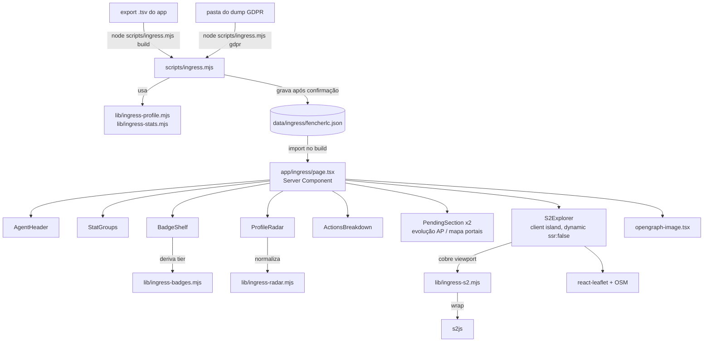

# Ingress — Perfil de Agente Design

**Spec**: `.specs/features/ingress/spec.md`
**Context**: `.specs/features/ingress/context.md`
**Status**: Approved (2026-09-07)

---

## Research (Knowledge Verification Chain)

**Codebase / project docs:**

- Não há biblioteca de gráficos no `package.json`. `/stats` desenha seu
  `TimelineChart` com **SVG inline à mão** (`app/stats/page.tsx:248`). É o padrão
  do projeto — nada de Chart.js/Recharts.
- `framer-motion` já é dependência (animações de Quiz/Nuvem/Sorteio) — disponível
  para as micro-interações e a animação de boot do hero.
- Rota de seção própria: `/casamento` tem `layout.tsx` (fontes via
  `next/font/google`, `metadata` com OpenGraph/Twitter), `icon.tsx`,
  `opengraph-image.tsx`. `/livros` tem layout próprio e é PT-only fora do
  `LanguageProvider`. `/ingress` segue esses dois.
- Lógica pura testável: `lib/*.mjs` + `lib/*.test.mjs`, rodada por
  `npm test` (`node --test --test-concurrency=1 "lib/**/*.test.mjs"`). Ex.:
  `lib/coisas-da-sala.mjs` é fonte única de uma lista consumida por vários
  lugares — mesmo padrão para o mapa de estatísticas do Ingress.
- Não há `data/` no repo; `content/caderno/` existe e fica fora de `public/`.

**Web (libs novas — ver Tech Decisions para a escolha):**

- **s2js** (`npm i s2js`, site `s2js.org`) — port TypeScript puro da lib S2 do
  Google, roda no browser, exporta tipos. Tem `RegionCoverer` (cobrir uma
  bbox/polígono com células num nível) e `Cell`/`CellId` com vértices de borda.
  É o encaixe direto para "desenhar a grade S2 sobre a viewport". S2 é
  open-source do Google — não é dado da Niantic.
- **react-leaflet 5.0.0** — compatível com React 19 + Next 15 App Router
  (confirmado em projetos públicos). Exige `'use client'` + `dynamic(..., { ssr:
  false })` porque o Leaflet toca `window`. CSS via `import
  'leaflet/dist/leaflet.css'`. Tiles OSM não precisam de chave de API.
- **@radarlabs/s2** foi descartada: são bindings C++ para Node, não roda no
  browser.
- Estrutura do dump GDPR: mapeada em `docs/ingress-gdpr-dump-estrutura.md`
  (a partir da leitura do parser open-source `ingresspub/ingress.data.gdpr`).

---

## Architecture Overview

Pipeline offline → arquivo versionado → página estática. Nenhuma parte fala com a
Niantic em runtime; nenhuma parte usa banco.



**Por que assim:** o insumo (export, e depois o dump) é irregular e raro; o
consumo é uma página que precisa ser rápida e à prova de offline. Separar em
"script que produz um JSON estável" + "página que só lê JSON" mantém a página
trivial e o parsing todo em Node testável. É o mesmo desenho de `/livros`
(`scripts/livros.mjs` → banco → páginas), trocando o banco por um arquivo
versionado porque aqui é um agente só e o dado cabe num JSON.

---

## Approach Exploration

O desenho do pipeline acima é único (não há alternativa sensata). As escolhas
reais são de dependência e de direção visual:

### Decisões técnicas (recomendação → confirmar)

| Eixo | Recomendado | Alternativa | Trade-off |
| --- | --- | --- | --- |
| Onde vive o dado | `data/ingress/fencherlc.json`, `import` direto no Server Component | `content/` + leitura `fs` (+ `outputFileTracingIncludes`) | `import` é type-safe e não precisa de config de tracing; o dado entra no bundle (é pequeno, ~2 KB) |
| Gráficos (radar, distribuição, evolução AP) | SVG inline à mão, como `/stats` | Adicionar `recharts`/`chart.js` | Manter o padrão do projeto, zero peso novo de bundle, controle total do visual sci-fi; custo: escrever a matemática do radar (fica em lib testada de qualquer forma) |
| Geometria S2 | `s2js` (TS puro, browser, `RegionCoverer`) | `s2-geometry` (hunterjm, 8 anos, sem manutenção) | `s2js` é mantido e tipado; risco: lib nova no projeto |
| Mapa do explorador S2 | `react-leaflet` 5 + tiles OSM | Leaflet puro sem wrapper / MapLibre GL | `react-leaflet` é idiomático em React; MapLibre é mais pesado e desnecessário para tiles raster |
| Badges e radar | Derivados **no render** a partir de `stats` + tabelas em `lib/` | Congelados no JSON pelo script | Corrigir um limiar de tier não deve exigir re-ingestão; o JSON fica sendo só o snapshot de dados |

**Dependências novas no `package.json`:** `s2js`, `leaflet`, `react-leaflet`,
`@types/leaflet` (dev). Só o `S2Explorer` (client island, carregado por
`dynamic`) as puxa — não pesam no resto da página.

### Direção visual (precisa da sua escolha)

Referências: HUD do **scanner do Ingress Prime** (verde XM sobre quase-preto,
malha hexagonal, varredura de radar, feed de COMM), tela de **glyph hacking**
(sequências de símbolos angulares numa grade triangular), os **campos de
controle triangulares** do mapa Intel, e os **biocards** que agentes trocam
(retrato + codinome em fonte técnica + nível num hexágono + fileira de
medalhas). A grade de células **S2 é literalmente a mesma malha hexagonal** que
o jogo usa para portais — o motivo visual e a seção interativa são a mesma coisa.

**Direção A — "Scanner" (recomendada).** A página é o HUD do scanner. Fundo
verde-quase-preto (não preto puro), painéis num carvão levemente elevado com um
fio de 1px em verde-XM que emite um brilho sutil. Verde Enlightened como
primária, um verde escuro para preenchimentos, branco-esverdeado para texto. O
motivo estrutural é o **campo triangular**: molduras de seção com cantos em
triângulo. O hero é o codinome sobre uma malha de células animada que se
"desenha" uma vez no load (scanner ligando; `prefers-reduced-motion` → estática)
— a mesma malha S2 da seção interativa, amarrando a página. Os números são o
herói: figuras grandes com brilho, a grade de glyphs atrás. Badges como medalhas
hexagonais (as badges do Ingress são hexagonais). Lê na hora como "perfil de
Ingress", funciona bem no celular.

**REVISÃO (2026-09-07, pós-Fase 2): "Prime" em vez de "Scanner clássico".** O
primeiro corte ficou muito Ingress 2013 (terminal hacker, verde-em-preto, fios,
cantos recortados). O Luiz quer o visual do **Ingress Prime** — o redesenho
moderno: base carvão com fundo azulado (não verde-preto), painéis com cantos
arredondados e leve transparência/lift, brilho (bloom) mais generoso e macio, um
sistema de cor em **gradiente** verde → teal → ciano para acentos e gráficos,
tipografia geométrica limpa (Sora no display, não a Chakra Petch retrô), mais
respiro. O hexágono continua (Prime mantém), mas com preenchimento em gradiente e
glow, não clip-path duro. Sem a grade de linhas repetida no fundo — só um brilho
radial suave. É esta a direção a partir de T14; o theme.css e o hero de T8–T10
foram retrabalhados no commit `refactor(ingress): direção visual Prime`.

**Direção B — "Códex de glyphs" (mais ousada).** Menos HUD, mais documento
traduzido de um texto antigo. Papel quase-preto, tinta verde. A identidade do
agente aparece como uma sequência de glyphs que decodifica para o codinome; os
stats são dispostos como um diário de campo, com linhas de régua angulares
formando células triangulares. Tipografia pareia um display angular com um
serif humanista ("tradução de texto antigo"). Mais único, menos familiar como
"dashboard", exige mais cuidado para não virar ilegível no mobile.

Ambas evitam os tells genéricos (sem label em CAIXA ALTA travada, sem realce de
uma palavra só, sem "01/02/03" a menos que seja sequência de verdade — a
timeline de AP é a única sequência real, sem "→" em botão, sem mono para label
de dado: os números usam o display técnico, os labels usam o corpo).

---

## Code Reuse Analysis

### Existing Components to Leverage

| Componente | Local | Como usar |
| --- | --- | --- |
| Padrão de layout de seção | `app/casamento/layout.tsx` | Copiar a estrutura: `next/font/google`, `metadata` com OG/Twitter, wrapper com `variable` das fontes |
| `opengraph-image.tsx` | `app/casamento/opengraph-image.tsx` | Mesmo mecanismo (`ImageResponse`) para a imagem OG de `/ingress` |
| `icon.tsx` | `app/casamento/icon.tsx` | Favicon próprio da rota (hexágono Enlightened) |
| `TimelineChart` (SVG à mão) | `app/stats/page.tsx:248` | Referência de como fazer um gráfico SVG responsivo com `viewBox`; a evolução de AP (P3) é praticamente o mesmo gráfico |
| Padrão "lista em arquivo único" | `lib/coisas-da-sala.mjs` | `lib/ingress-stats.mjs` é a fonte única das colunas/labels/grupos, consumida pelo script E pela página |
| Padrão CLI | `scripts/livros.mjs` | Parsing de args, `--dry-run`/`--apply`, mostrar o que vai gravar e confirmar |
| Padrão de teste | `lib/book-utils.test.mjs` | `node:test` + `node:assert/strict`, casos em português |
| `framer-motion` | dependência existente | Animação de boot do hero, contadores, reveal de badges |
| `clsx` | dependência existente | Composição de classes condicionais |

### Integration Points

| Sistema | Integração |
| --- | --- |
| Roteador Next (App Router) | Nova rota `app/ingress/` com `layout.tsx` próprio |
| `middleware.ts` | Nenhuma mudança — o `page_view` de `/ingress` é capturado automaticamente |
| `LanguageProvider` | `/ingress` fica **fora** dele (PT fixo), como `/livros` |
| `next.config.ts` | Só se o dado for para `content/` (não é — vai para `data/` e é importado) |
| Analytics (`utils/analytics.ts`) | Nenhum evento custom no MVP |

---

## Components

### `scripts/ingress.mjs`

- **Purpose**: CLI local que transforma o export do app (e depois o dump GDPR) no
  JSON de perfil.
- **Location**: `scripts/ingress.mjs`
- **Interfaces** (comandos):
  - `node scripts/ingress.mjs build <export.tsv> [--apply]` — lê o TSV, monta o
    perfil, faz merge com o JSON existente (preserva `timeSeries`/`portals`),
    dry-run por padrão, grava após confirmação com `--apply`.
  - `node scripts/ingress.mjs gdpr <dump-dir> [--apply]` — lê os `.tsv` de série
    temporal e as listas de portais da pasta do dump, adiciona ao JSON, limpa as
    entradas de `pending` preenchidas.
  - `node scripts/ingress.mjs show` — imprime um resumo do JSON atual.
- **Dependencies**: `node:fs`, `node:path`, `lib/ingress-profile.mjs`.
- **Reuses**: estilo de `scripts/livros.mjs` (confirmação, `--dry-run`).

### `lib/ingress-stats.mjs`

- **Purpose**: Fonte única do mapeamento coluna do export → chave estável, label
  pt-BR, grupo e formato. Também define a ordem dos grupos.
- **Location**: `lib/ingress-stats.mjs` (+ `.test.mjs`)
- **Interfaces**:
  - `STAT_COLUMNS: { col, key, label, group, kind }[]` — `kind` distingue
    `identity` (Level, Recursions, Months Subscribed, Agent Name/Faction) de
    `stat`.
  - `STAT_GROUPS: { id, title, keys: string[] }[]` — AP/XM, portais,
    links/campos, hacking, drones, Machina, exploração/eventos.
  - `parseAppExport(tsvText): { agent, capturedAt, stats }` — valida cabeçalho vs.
    linha, número de colunas, converte números (remove separador de milhar e
    aspas). Lança `Error` com mensagem específica em caso de formato inválido.
- **Dependencies**: nenhuma.
- **Reuses**: padrão `lib/coisas-da-sala.mjs`.

### `lib/ingress-profile.mjs`

- **Purpose**: Montagem e merge do objeto de perfil.
- **Location**: `lib/ingress-profile.mjs` (+ `.test.mjs`)
- **Interfaces**:
  - `buildProfile(parsedExport, { previous }): Profile` — cria/atualiza o
    `Profile`; se `previous` tem `timeSeries`/`portals`, preserva; recalcula
    `pending`.
  - `mergeGdprDump(profile, dumpData): Profile` — funde séries temporais e
    portais; remove de `pending` o que passou a existir; mantém `agent`/`stats`
    mais recentes por `capturedAt`.
  - `SCHEMA_VERSION` — inteiro; o loader da página rejeita versão desconhecida.
- **Dependencies**: `lib/ingress-stats.mjs`.

### `lib/ingress-badges.mjs`

- **Purpose**: Tabela de badges + limiares oficiais por tier e o cálculo de tier.
- **Location**: `lib/ingress-badges.mjs` (+ `.test.mjs`)
- **Interfaces**:
  - `BADGES: { key, name, statKey, tiers: {bronze,silver,gold,platinum,onyx} }[]`
    — limiares copiados da wiki oficial do Ingress na implementação.
  - `computeBadge(badgeDef, statValue): { tier, atMax, next: {tier, remaining} | null }`
  - `computeAllBadges(stats): Badge[]` — omite badges sem a `statKey` no `stats`.
- **Dependencies**: nenhuma.
- **Test focus**: valores nas fronteiras (ex.: exatamente no limiar de Gold →
  Gold; um a menos → Silver), tier máximo, estatística ausente.

### `lib/ingress-radar.mjs`

- **Purpose**: Normalização dos eixos do radar do perfil.
- **Location**: `lib/ingress-radar.mjs` (+ `.test.mjs`)
- **Interfaces**:
  - `RADAR_AXES: { id, label, statKeys: string[], reference: number }[]` — cada
    eixo soma uma ou mais stats e divide por uma referência definida em código.
  - `computeRadarAxes(stats): { id, label, raw, value: number /*0..1*/ }[]` —
    `value` saturado em 1; stat ausente conta 0.
- **Dependencies**: nenhuma.

### `lib/ingress-s2.mjs`

- **Purpose**: Matemática de cobertura S2 de uma viewport, isolada do mapa.
- **Location**: `lib/ingress-s2.mjs` (+ `.test.mjs`)
- **Interfaces**:
  - `coverViewport({ north, south, east, west }, level, { cap = 400 }): { token, ring: [lat, lng][] }[]`
    — `s2js` `RegionCoverer` com `maxLevel = level` + `maxCells = cap` faz a
    cobertura grossa (rápida mesmo numa bbox continental), depois uma BFS
    subdivide até `level` parando no `cap`. (Fixar `minLevel = maxLevel` trava
    numa bbox enorme — este é o fallback já previsto em Risks & Concerns.)
    Devolve os anéis de borda; nunca mais que `cap` células.
  - `LEVEL_RANGE: { min, max, default }` — faixa do slider (ex.: 6–16, default
    12).
- **Dependencies**: `s2js`.
- **Test focus**: uma bbox pequena conhecida num nível conhecido gera um conjunto
  determinístico de tokens; o `cap` é respeitado numa bbox grande.

### `lib/ingress.ts`

- **Purpose**: Lado Next — tipos `Profile`/`Stats`/`Badge` e o loader.
- **Location**: `lib/ingress.ts`
- **Interfaces**:
  - `loadProfile(): Profile` — `import` do JSON, valida `schemaVersion`, retorna
    tipado. Se ausente/inválido → retorna `null` (a página trata).
- **Dependencies**: `data/ingress/fencherlc.json`.

### `app/ingress/layout.tsx`

- **Purpose**: Layout próprio da rota — fontes, tema, `metadata`.
- **Location**: `app/ingress/layout.tsx`
- **Interfaces**: exporta `metadata` (OG/Twitter com título/descrição próprios) e
  o componente de layout (wrapper com `variable` das fontes, sem header/footer do
  site).
- **Reuses**: `app/casamento/layout.tsx`.

### `app/ingress/page.tsx`

- **Purpose**: Server Component que lê o perfil e compõe as seções.
- **Location**: `app/ingress/page.tsx`
- **Interfaces**: default export `async function Page()`.
- **Dependencies**: `lib/ingress.ts` e os componentes de seção.
- **Notes**: sem `'use client'`. Passa dados já computados (badges, eixos do
  radar) como props para os componentes.

### `components/ingress/*` (Server, exceto onde indicado)

| Componente | Client? | Papel |
| --- | --- | --- |
| `AgentHeader.tsx` | não | Codinome, facção, nível, recursões, meses; hero com a malha |
| `HeroMesh.tsx` | **sim** (leaf) | A malha de células que se desenha no load; `prefers-reduced-motion` → estática. `framer-motion` |
| `StatGroups.tsx` | não | Renderiza `STAT_GROUPS` a partir de `stats`, números pt-BR; item ausente é omitido |
| `StatValue.tsx` | não (ou leaf client p/ count-up) | Um número + label |
| `CountUp.tsx` | **sim** (leaf) | Contador animado opcional; respeita reduced-motion; fallback = valor final |
| `BadgeShelf.tsx` / `BadgeMedal.tsx` | não | Medalhas hexagonais com tier e "falta X para o próximo" |
| `ProfileRadar.tsx` | não | SVG do radar a partir dos eixos já normalizados |
| `ActionsBreakdown.tsx` | não | SVG de barras/rosca de uma família de contagens |
| `PendingSection.tsx` | não | Placeholder "aguardando dump GDPR" (evolução de AP, mapa de portais) |
| `ApTimeline.tsx` | não | SVG da evolução de AP quando `timeSeries.lifetimeAp` existe (P3) |
| `S2Preview.tsx` | não | Preview estático: grade S2 (de `lib/ingress-s2.mjs`, calculada no server para a viewport default) desenhada em SVG sobre um fundo estilizado + botão "tocar para explorar as células" |
| `S2Explorer.tsx` | **sim** | Ilha cliente montada só após o toque no preview: `dynamic(() => import(...), { ssr: false })`, Leaflet + slider de nível; usa `lib/ingress-s2.mjs`; fallback se o mapa não carrega (preview permanece) |

### `app/ingress/opengraph-image.tsx` (P2)

- **Purpose**: Imagem OG (`ImageResponse`) com codinome, facção, nível e números
  de destaque.
- **Reuses**: `app/casamento/opengraph-image.tsx`.

---

## Data Models

### `Profile` (`data/ingress/fencherlc.json`)

```typescript
interface Profile {
  schemaVersion: number                    // SCHEMA_VERSION; loader rejeita desconhecido
  agent: {
    codename: string
    faction: 'enlightened' | 'resistance'
    level: number
    recursions: number
    monthsSubscribed: number
  }
  capturedAt: string                        // ISO local, da linha do export
  sources: {
    appExport: { capturedAt: string } | null
    gdprDump: { generatedAt: string } | null
  }
  stats: Record<string, number>             // chaves de STAT_COLUMNS (kind === 'stat')
  s2: { center: { lat: number, lng: number }, defaultLevel: number }
  timeSeries: Record<string, { t: string, v: number }[]> | null   // só via dump GDPR
  portals: {
    visited: { lat: number, lng: number, name?: string }[]
    submitted: { lat: number, lng: number, name?: string }[]
  } | null                                                        // só via dump GDPR
  pending: ('apTimeline' | 'portalMap')[]   // seções em estado de espera
}
```

**Semente inicial:** os números reais de `docs/ingress-perfil-fencherlc.md`
(export de 2026-09-07). `timeSeries` e `portals` = `null`, `pending` =
`['apTimeline', 'portalMap']`. `s2.center` = coordenada da cidade do Luiz (ele
fornece; até lá, um fallback definido em código — ver Edge Cases da spec).

**Relações:** `stats` é dono das chaves definidas em `lib/ingress-stats.mjs`.
`badges` e `radar` **não** são persistidos — derivados no render de `stats`.

### Tabela de badges (`lib/ingress-badges.mjs`)

`BADGES[]` com `tiers` de 5 níveis. Valores oficiais transcritos da wiki do
Ingress durante a implementação (INGR-16). Badges de contagem cobertas no MVP:
Builder, Connector, Mind Controller, Illuminator, Liberator, Pioneer, Explorer,
Trekker, Purifier, Hacker (+ Sojourner, Recharger, etc. conforme houver stat de
origem).

---

## Error Handling Strategy

| Cenário | Tratamento | Impacto p/ usuário |
| --- | --- | --- |
| Export com nº de colunas ≠ cabeçalho | `parseAppExport` lança `Error` com a linha/contagem; script não grava | Mensagem no terminal; JSON intacto |
| Export sem a linha de dados | idem | idem |
| Número com separador de milhar / aspas | Normalizado antes do `Number()` | transparente |
| `capturedAt` novo mais antigo que o do JSON | Script avisa e pede confirmação extra | Prompt no terminal |
| JSON de perfil ausente/`schemaVersion` desconhecido | `loadProfile()` → `null`; página renderiza estado vazio informativo | "Perfil ainda não publicado" em vez de 500 |
| Chave de stat ausente no JSON | `StatGroups`/`computeAllBadges`/`computeRadarAxes` omitem/zeram aquele item | Seção renderiza sem o item |
| Sem `s2.center` no JSON | Fallback de coordenada em código | Mapa abre no fallback |
| Leaflet/tiles não carregam | `S2Explorer` mostra mensagem de fallback na seção | "Mapa indisponível agora"; resto da página intacto |
| Viewport S2 gera milhares de células | `coverViewport` limita a `cap` | Grade deixa de adensar além do teto |
| Arquivo do dump GDPR ausente/vazio | `mergeGdprDump` registra aviso e segue | Aviso no terminal; seção correspondente continua em `pending` |
| `prefers-reduced-motion` | `HeroMesh`/`CountUp` renderizam estado final estático | Sem animação |

---

## Risks & Concerns

| Concern | Local | Impacto | Mitigação |
| --- | --- | --- | --- |
| Limiares de badge errados corrompem o resultado exibido | `lib/ingress-badges.mjs` (a criar) | Perfil mostra tier errado — e o perfil é compartilhado | Transcrever da wiki oficial na task; teste de fronteira por tier (INGR-16); revisão manual contra os números do FencherLC |
| Leaflet + SSR no App Router | `components/ingress/S2Explorer.tsx` | Build quebra / hydration error | `dynamic(..., { ssr: false })` + `'use client'` só nesse componente; CSS do Leaflet importado no client |
| `s2js` é lib nova no projeto, API pode divergir do esperado | `lib/ingress-s2.mjs` | `coverViewport` não produz o esperado | Isolar 100% do uso de `s2js` nesse arquivo com testes determinísticos; se `RegionCoverer` não servir, fallback para iterar `CellId` filhos manualmente |
| Export do app de 2026 pode ter colunas a mais/menos que o snapshot atual | `lib/ingress-stats.mjs` | Parsing falha num export futuro | `parseAppExport` casa por **nome de coluna do cabeçalho**, não por posição; colunas desconhecidas viram warning, não erro |
| Peso de bundle do mapa no mobile | `S2Explorer` | Primeira carga lenta no celular | `dynamic` com `ssr:false` já code-splitta; a seção S2 fica abaixo da dobra; considerar carregar o mapa sob interação ("tocar para explorar") |
| Dump GDPR real pode ter formato diferente do parser de 2021 | `lib/ingress-profile.mjs` `mergeGdprDump` | P3 não funciona no dump real | P3 só entra quando o dump chegar; `mergeGdprDump` é escrito contra fixtures e ajustado com o dump real em mãos |
| `data/ingress/fencherlc.json` versionado expõe todos os números + coordenada da cidade | repo público | Qualquer um lê o JSON cru | É intencional (a página mostra tudo); a coordenada é a da cidade, não de casa — Luiz ciente (context.md) |

---

## Tech Decisions

| Decisão | Escolha | Racional |
| --- | --- | --- |
| Fonte de dados | Arquivo JSON versionado + script local, sem banco | Um agente só; dado pequeno e estável; sem superfície de escrita pública (igual `/livros`) |
| Gráficos | SVG inline à mão | Padrão do projeto (`/stats`), zero peso novo, controle total do visual |
| Geometria S2 | `s2js` | Único port TS mantido que roda no browser com `RegionCoverer` |
| Mapa | `react-leaflet` 5 + OSM | Idiomático em React 19/Next 15; tiles raster sem chave de API |
| Badges/radar | Derivados no render | Corrigir limiar/normalização não exige re-ingestão |
| Chaves de stat | Casadas por nome de coluna do cabeçalho | Resiliente a export futuro com colunas em ordem/quantidade diferente |
| `S2Explorer` | Único componente `'use client'` + `dynamic ssr:false` | Mantém a página Server; isola o peso do mapa |
| Idioma | PT fixo, fora do `LanguageProvider` | Igual `/livros` e dinâmicas |

> **Project-level:** ver `AD-001` e `AD-002` propostos em `.specs/STATE.md`
> (arquivo de dado versionado como "banco" de uma feature; e SVG à mão como
> padrão de gráfico do projeto).

---

# Expansão — Medalhas (Onda 1) — Design

**Spec**: seção "Expansão — Medalhas" em `spec.md` (MED-01..MED-08)
**Análise**: `docs/ingress-medalhas-analise.md`
**Status**: Approved (2026-09-07)

## Pesquisa

`https://ingress.plus/api/collections/i37o5ykupb5voix/records?perPage=400` — API
PocketBase aberta, 391 badges. Para 26 delas o `stat_line` casa com uma coluna do
export (as 14 atuais + Translator, Seer, Recruiter, Guardian, Recon, Scout, Scout
Controller, NL-1331 Meetups, Mission Day, First Saturday, Second Sunday, Operation
Clear Field). Cada uma traz `tier_values`, `requirement` e 5 nomes de arquivo de
arte. Todas computáveis pelo mesmo mecanismo que já existe.

## Modelo de dados

### `data/ingress/badge-catalog.json` (NOVO, versionado)

Gerado do ingress.plus, editado por CLI. Uma entrada por badge:

```jsonc
{
  "builder": {
    "name": "Builder", "group": "core", "statKey": "resonatorsDeployed",
    "tiers": [2000, 10000, 30000, 100000, 200000],
    "requirement": "Deploy {0} Resonators…",
    "ipId": "lfwvt6ivbrgzsro",
    "ipArt": ["badge_builder_bronze_yrWPmTbc6W.png", "…silver…", "…gold…", "…platinum…", "…black…"]
  },
  "recursion": { "name": "Recursion", "group": "anomaly", "count": true,
    "ipId": "n19lc27gub8e3v2", "ipArt": ["anomaly_recursion_E8dbh90c19.png"] }
}
```

`group`: `core` (stat, 5 tiers) · `anomaly` · `event` · `character` · `collectible` · `other`.
`ipId`/`ipArt` só servem ao `medals --fetch`. A arte no site é
`public/ingress/medals/<slug>-<tier>.png` (core) ou `<slug>.png` (single).

### `data/ingress/fencherlc.json` — campos novos

```jsonc
{
  // … campos atuais …
  "history": [ { "t": "2026-09-07T16:21:02", "stats": { …54… } } ],
  "medalDates": { "trekker": { "gold": "2021-08-01", "onyx": "2024-03-12" } },
  "eventBadges": [
    { "slug": "recursion", "count": 2 },
    { "slug": "darsana-prime", "dates": { "single": "2019-07-20" } }
  ]
}
```

`timeSeries` (modelo antigo, para o dump) fica; `history` é a fonte para
projeção/evolução e é preenchido também por exports periódicos. Na migração,
`history` nasce com o snapshot atual.

## Componentes

| Arquivo | Papel |
| --- | --- |
| `data/ingress/badge-catalog.json` | Catálogo (dado) |
| `lib/ingress-catalog.mjs` (+test) | `loadCatalog()`, `catalogEntry(slug)`, `coreBadges()`, `slugForStatKey(key)`, `artPath(slug, tier)` |
| `lib/ingress-badges.mjs` (refactor) | `BADGES` passa a derivar do catálogo (26 core); `computeBadge`/`computeAllBadges` inalterados na assinatura; `nextMedal(badges)` (maior % até o próximo tier, desempate por ordem do catálogo); `tierCounts(badges)` |
| `lib/ingress-history.mjs` (+test) | `appendSnapshot(history, snap)` (dedupe por `t`, ordena); `ratePerDay(history, statKey)`; `projectNextTier(history, badgeDef, value)` → `{tier, date}` \| `{reason}` \| `null` |
| `lib/ingress-timeline.mjs` (+test) | `collectAcquisitions(profile, catalog)` → `[{slug, name, tier, date}]` ordenado; ignora data inválida |
| `lib/ingress-medal-art.mjs` (refactor) | passa a resolver por slug+tier via catálogo; fallback continua |
| `app/ingress/medalha/[slug]/page.tsx` | Detalhe: `generateStaticParams` do catálogo; `notFound()` para slug desconhecido; escada de tiers, requisito, posição, datas |
| `app/ingress/medalha/[slug]/opengraph-image.tsx` | OG por badge (P2) |
| `components/ingress/BadgeShelf.tsx` (refactor) | 26 badges (grid), resumo de tiers, "próxima medalha"; cada badge é `<Link href="/ingress/medalha/<slug>">` |
| `components/ingress/BadgeMedal.tsx` (refactor) | vira link; variante compacta |
| `components/ingress/TierLadder.tsx` | os 5 degraus (arte + limiar) com o atual marcado — usado no detalhe |
| `components/ingress/AchievementsShelf.tsx` | `eventBadges` agrupadas por `group`; convite se vazio |
| `components/ingress/AchievementTimeline.tsx` | SVG da timeline de `collectAcquisitions`; placeholder se `< 2` datas |
| `components/ingress/KpiBadgeHint.tsx` (client leaf) | hover/focus num KPI → mini-arte + tier da badge; no touch, ícone pequeno sempre visível |
| `components/ingress/StatValue.tsx` (refactor) | recebe `badge?` e envolve o valor no `KpiBadgeHint` |
| `app/ingress/page.tsx` (refactor) | nova ordem: hero → BadgeShelf → AchievementsShelf → AchievementTimeline → StatGroups → radar → … |
| `scripts/ingress.mjs` (refactor) | `build` faz `appendSnapshot`; comando `badges` (editar `eventBadges` + `medalDates`, dry-run/`--apply`); `medals --fetch` (baixa `ipArt` do catálogo p/ slugs faltando) |
| `scripts/ingress-catalog-gen.mjs` (NOVO, one-off) | regera `badge-catalog.json` do ingress.plus (histórico, como a migração do `casara`) |

## Reuso

- SVG à mão (radar/timeline já fazem) para `AchievementTimeline`.
- `PendingSection` como base do placeholder da timeline.
- Padrão `generateStaticParams` + `notFound` — igual `app/livros/[slug]/page.tsx`.
- `medals --fetch` reusa `baixarCapa`-style de `scripts/ingress.mjs` (download + valida PNG).
- `history` no `build` reusa `mergeGdprDump` para inserção ordenada.

## Migração dos 14 PNGs existentes

`mindController-platinum.png` → `mind-controller-platinum.png` etc. (slug kebab).
Feito num passo do `medals --fetch` ou um rename explícito na primeira task.

## Risks & Concerns (expansão)

| Concern | Local | Impacto | Mitigação |
| --- | --- | --- | --- |
| `lib/ingress-badges.mjs` é arquivo Verified; refatorar para data-driven | `lib/ingress-badges.mjs` | Regressão nos 14 badges já verificados | Testes atuais (`ingress-badges.test.mjs`) ficam como contrato; catálogo tem os mesmos limiares; sensor re-roda no Verifier |
| Arte: 26 × 5 = 130 imagens (~1 MB) no repo | `public/ingress/medals/` | Repo cresce | thumbs ~96px; `medals --fetch` incremental; documentado (como `public/livros/capas/`) |
| ingress.plus pode sair do ar / mudar o schema | `scripts/ingress-catalog-gen.mjs` | Não dá pra regerar o catálogo | O `badge-catalog.json` é versionado — uma vez gerado, o site não depende do ingress.plus em runtime nem em build |
| `eventBadges` dependem de transcrição manual de prints | `data/ingress/fencherlc.json` | Trabalhoso, sujeito a erro | CLI `badges` valida slug contra o catálogo; datas inválidas são ignoradas na timeline |
| `history` com 1 ponto (hoje) | projeção | Projeção não funciona no lançamento | MED-08 é P3, com placeholder explícito ("precisa de mais um export") |

## Tech Decisions (expansão)

| Decisão | Escolha | Racional |
| --- | --- | --- |
| Catálogo | Arquivo JSON versionado, gerado uma vez do ingress.plus | Zero dependência de runtime/build; mesmo princípio do resto da feature |
| Slugs | kebab-case, canônicos, = chave do catálogo e do `/medalha/[slug]` | URL limpa, um identificador só |
| 26 badges (não 14) | Todas as de `stat_line` mapeável entram | Custo marginal zero, perfil muito mais rico |
| Detalhe = rota estática | `generateStaticParams` | 26 páginas pequenas, SEO, compartilhável, sem custo de runtime |
| Datas de conquista | Campo esparso, transcrito de prints agora, completado pelo dump | O jogo mostra as datas; esperar o dump seria desperdício |

## Iteração de UI (09/09/2026) — componentes

Rodadas de feedback do Luiz. Cada mudança BOUNDED (brainstorming → design curto
no chat → aprovação). Ver stories MED-09..MED-13 no `spec.md`.

| Arquivo | Papel |
| --- | --- |
| `lib/ingress-art.mjs` (NOVO) | Só `artPath(slug, tier)` — sem `node:fs`, importável por client component. `ingress-catalog.mjs` re-exporta. |
| `lib/ingress-timeline.mjs` (+test) | +`annotateLaneGaps(rows)` (gapDays/prevTier por raia, JSDoc genérico), +`groupLanes(rows)` (raia por medalha: tiers ordenados, maior tier, 1ª data), +`formatGap(days)` (`"1a 3m"`). `collectAcquisitions` passa a propagar `group`. |
| `lib/ingress-badges.mjs` (+test) | `computeBadge` retorna `beyond` (progresso além do Onyx: próxima dobra ×N, `remaining`, `pct`). |
| `lib/ingress-lore.mjs` (NOVO, +test) | `loadLore()`, `medalLore(slug, value, daysPlaying)` (razão por `per` / média por `rate`, descarta ≤0), `formatLoreNumber(n)`. |
| `data/ingress/medal-lore.json` (NOVO) | Conteúdo: `{ slug: { blurb, facts:[{per|rate, label}] } }` para 17 medalhas de estatística. Editável sem código. |
| `components/ingress/MedalSpark.tsx` (NOVO) | Mini gráfico dos tiers de uma medalha nas datas reais. Sem estado — server-safe. Usado no painel de detalhe e na página da medalha. |
| `components/ingress/MedalDetail.tsx` (NOVO, client leaf) | Painel de detalhe compartilhado: arte, faixa de progresso, `MedalSpark`, escada (limiar/data/intervalo para estatística, só data para evento), `beyond`, link. `scrollIntoView` ao abrir. |
| `components/ingress/MedalGrid.tsx` (NOVO, client leaf) | Grade de hexágonos da home; toggle Cronologia\|Categoria; "próxima medalha"; toque → `MedalDetail`; grupos Colecionáveis/Personagens = placeholder. |
| `components/ingress/AchievementTimeline.tsx` (rewrite) | `variant="resumo"` (curva + medalhas recentes no `/ingress`) e `variant="completo"` (combo: overview + brush de zoom + filtros + swimlane com rótulos fixos e scroll-x + `MedalDetail`). `medalStats` prop traz limiar/valor/`beyond` por slug. |
| `app/ingress/linha-do-tempo/page.tsx` + `opengraph-image.tsx` (NOVO) | Rota dedicada da linha do tempo; monta `medalStats` via `computeBadge`. |
| `app/ingress/medalha/[slug]/page.tsx` (rewrite) | Ordem: herói (com %) → `MedalLore` → requisito → `MedalSpark` → `TierLadder` (agora com intervalo entre datas + % do próximo) → projeção. |
| `components/ingress/TierLadder.tsx` (refactor) | +coluna de intervalo (`formatGap`), +`value` prop para o % do primeiro tier não alcançado, data formatada pt-BR. |
| `app/ingress/page.tsx` (rewrite) | `MedalGrid` no lugar de `BadgeShelf` + `AchievementsShelf`; monta a lista via `computeAllBadges` + `groupLanes` + `medalArt`. |
| **Removidos** | `BadgeShelf.tsx`, `AchievementsShelf.tsx`, `BadgeMedal.tsx` (substituídos por `MedalGrid` + `MedalDetail`). CSS morto desses no `theme.css` — limpar depois. |
| `app/ingress/theme.css` | Tokens Onyx `#626873` / Platina `#8d949d` (neutros); `.ing-tl__*` (combo, painel, swimlane), `.ing-mgrid__*`, `.ing-spark__*`, `.ing-lore__*`, `.ing-ladder__gap`. |

**Hidratação:** `<title>` de SVG recebe um único filho string (React 19 não
insere marcador de fronteira de nó de texto dentro de `<title>`) — corrigido em
`ProfileRadar`, `ApTimeline`, `AchievementTimeline`.

### Radar "Padrão de jogo" (MED-14/15)

- `lib/ingress-radar.mjs` (rewrite, +test): `RADAR_AXES` com `parts:[{key,label,ref,badge?|note?}]`
  — cada `ref` é o limiar de Onyx de uma medalha real (`badge`) ou uma conversão
  de unidade explícita a partir de um (`note`, ex. `portalsNeutralized` = Onyx de
  Purifier ÷ 8). `computeRadarAxes` → `onyxRatio` (média das razões, cada uma
  travada em `RADAR_DRAW_MAX = 2` antes da média) + `value` (raio) + `parts` com
  a razão real. `compareRadar(mine, theirs)` → linha por eixo com o líder.
- `components/ingress/ProfileRadar.tsx` (server → **client leaf**): `%` do Onyx
  rotulado em cada vértice; hover/toque num eixo abre o cálculo (stat, `valor /
  limiar`, razão, nota); anel do meio "Onyx", borda destacada em 2×.
  **Comparar**: `<textarea>` → `parseAppExport` (reusa o parser do CLI,
  `lib/ingress-stats.mjs`, puro) → radar do outro agente sobreposto em `--ing-xm`
  + legenda + lista eixo-a-eixo. Sem export/salvar/backend. `agentName` prop nova
  em `app/ingress/page.tsx`.

## Design Questions — resolvidas (2026-09-07)

1. **Direção visual:** A — "Scanner" (HUD do Ingress Prime). *(Revisado depois
   para "Prime" — carvão + gradiente verde→teal→ciano, Sora/Barlow; tema em
   `app/ingress/theme.css`, wrapper `.ingress-prime`.)*
2. **Dependências:** aprovadas — `s2js`, `leaflet`, `react-leaflet`,
   `@types/leaflet` (dev).
3. **Mapa S2:** carrega **sob toque**. A seção mostra um preview estático
   (grade S2 desenhada sobre um placeholder de tile ou fundo estilizado) com um
   controle "tocar para explorar as células"; só nesse gesto o `S2Explorer`
   monta o Leaflet (`dynamic ssr:false`) e baixa os tiles. `prefers-reduced-motion`
   não afeta isso (é interação, não animação). Fallback se o mapa não carregar
   após o toque: mensagem na seção, preview estático permanece.

### Radar — iteração 2 (MED-14/15) + recursão + globo (10/09/2026)

- `lib/ingress-radar.mjs` (+test): `computeRadarAxes` retorna `parts[].note`
  (derivação da âncora, ex. `portalsNeutralized` = Onyx de Purifier ÷ 8);
  Destruição só com âncoras reais (Purifier + portais neutralizados), "Links e
  campos" ganha `mindUnitsCaptured` (Illuminator Onyx). `compareRadar(a, b)`.
- `ProfileRadar.tsx` (client leaf, agora antes de `StatGroups` no `page.tsx`):
  toggle de escala `½× / Onyx / 2× / Forma` (Forma = normaliza cada ficha pelo
  próprio pico); `viewBox` com `PAD_X` p/ os rótulos não cortarem; fonte do SVG
  reduzida. Comparar: modo "Contra o dono" ou "Dois agentes", radar + tabela
  lado a lado (`ing-radar__cmp-layout`).
- `lib/ingress-stats.mjs` (+test): `parseAppExport` normaliza export colado sem
  tabs — `tokenizeHeaderLoose` casa nomes de coluna conhecidos (desconhecidas
  multi-palavra agrupadas até a próxima conhecida), a linha de dados junta o
  "ALL TIME" e separa o resto por espaço.
- `components/ingress/RecursionMark.tsx` (server): chevrons vermelhos + `×N`
  quando `beyond.multiple >= 2`; usado em `MedalGrid`, `MedalDetail`,
  `medalha/[slug]`. `DetailStat.beyond` ganhou `multiple`.
- `components/ingress/HeroGlobe.tsx` + `lib/ingress-globe.ts` (outra sessão):
  globo decorativo girando no hero, só desktop.
